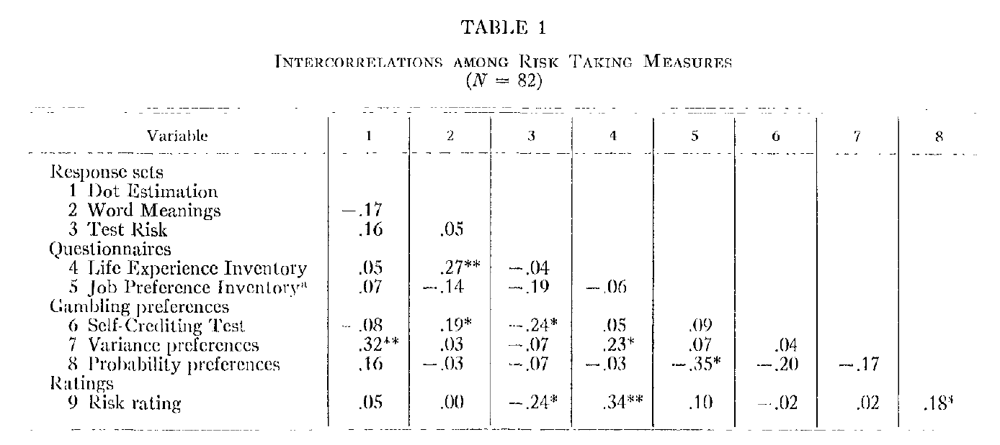
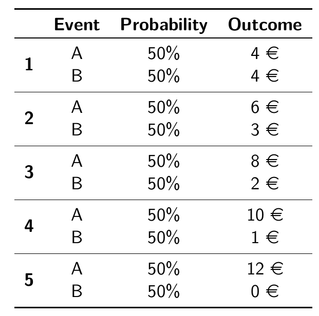
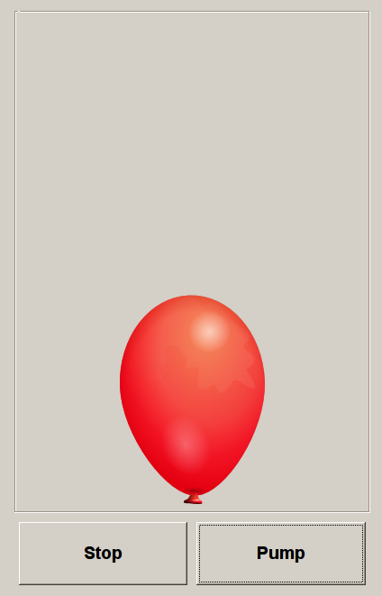
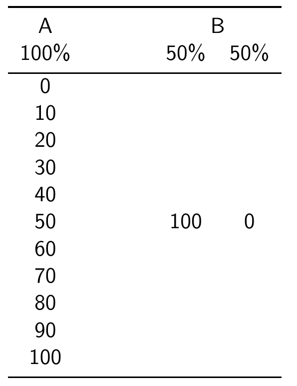

## Slovic (1962)

```{r setup, echo = F, message= F, warning=F}
knitr::opts_chunk$set(echo = F, warning = F, message = F)
library(tidyverse)
library(hrbrthemes)
theme_set(theme_ipsum_rc())
```


{width=800px}

> - *"...future research must carefully
consider the problem of adequately **defining** and
**assessing** risk taking behavior."*

# So, how are we doing?

## Measuring risk attitudes

> A **difficult** task with **crucial** relevance

- directly *unobservable*
- *latent* construct ($\Rightarrow$ requires a theory)
- should we..
  - *infer* from real world data or from *ad-hoc* choices
  - ask or **t**ask?
  - elicit by *descrption* or by *experience*?

## The state of the art: psychology

> risk loosely defined as **probability of harm**

> focus on **questionnaires** and **intuitive tasks**

- **Quests**:
  - directly ask
  - over different domains
  - tackle risk perception

- **Tasks**
  - hand in cold water
  - card/gambling tasks
  
> Metrics of success: **convergent validity** + **predictive validity**

## The state of the art: economics

> risk formally defined as **uncertainty over outcomes**

> focus on **decontextualized tasks** (and *questionnaires*)

- **The lottery paradigm**
  - incentives
  - risk task = choice over lotteries
  - different formats, cover stories, contexts
  - strong theoretical underpinning
  - estimation of utility functions ($\Rightarrow$ models)
  
> Metric of success: **internal validity** (task $\iff$ theory)

## METARET: goals

- **Part 1: state of the art**
  - a *detailed map* of elicited risk attitudes
  - an assessment of *convergent validity*
  - an assessment of *predictive validity*
  
- **Part 2: moving forward**
  - theoretical: what are we measuring?
  - empirical: develop a better tool

## METARET resources

- **your** data (*thanks!*)

- preregistration on [OSF](https://osf.io/h2z56/)

- transparent data collection & analysis on [gitHub](https://github.com/paolocrosetto/METARET)

- live data exploration on a [shiny app](https://paolocrosetto.shinyapps.io/METARET/)
  
## Contributors (17.321 subjects)

- Gnambs Appel and Oeberst (PONE 2015)
- Crosetto and Filippin (EXEC 2016)
- Filippin and Crosetto (ManSci 2016)
- Pedroni Frey Bruhin Dutilh Hertwig and Rieskamp (NHB 2016)
- Menkhoff and Sakha (JEconPsy 2017)
- Frey Pedroni Mata Rieskamp and Hertwig (ScAdv 2017)
- Nielsen (JEBO 2019)
- Charness Garcia Offerman and Villeval (WP 2019)
- Holzmeister and Stefan (WP 2018)
- Zhou and Hey (ExEc 2018)
- Fairley Parelman Jones and McKell Carter (JEconPsy 2018)
- Csermely Rabas (JRU 2018)


# Elicited risk attitudes

## Holt and Laury

{width=800px}

## Binswanger / Eckel and Grossmann

<p align="center">
  {width=400px}
</p>

## Bomb Risk Elicitation Task

<p align="center">
  {width=600p}
</p>

## Investment Game (Gneezy and Potters)

<p align="center">
  {width=600px}
</p>


## Balloon Analog Risk Task (Lejuez et al)

<p align="center">
  {width=300px}
</p>

## Certainty Equivalent MPL

<p align="center">
  {width=350px}
</p>

## How big are these differences?

```{r}
df <- tibble(x = seq(0.5,1,0.1)) %>% 
  mutate(y = 0.5*(100)^x)

ggplot(df, aes(x,y, label = round(y,1)))+
  geom_point()+
  geom_label(position = position_nudge(y = 3))+
  labs(x = "Risk aversion parameter of CRRA x^r",
       y = "certainty equivalent",
       title = "Certainty Equivalent of {0.5: 100; 0.5: 0} lottery",
       subtitle = "CRRA x^r")
```


# Convergent validity: correlations among RETs

# Questionnaires

# Predictive validity: correlation with questionnaires


## Frey et al

{width=700px}


# Why?

## Noise

## Risk perception

> **risk**, *ADDDEFINITION from NEWTON WEBSTER*

- definition in Econ and Finance: EV/variance + EUT

(risky curves...)

## Experimenting on risk perception

{width=800px}

## Theory

# Where do we go from here?

## Contribute to the meta-analysis!

> data, code, analysis, references on gitHub

> live exploration of results on shinyapps

## To contribute

- if you have run a RET
- if you have run TWO
- if you have run a RET and a questionnaire
- if you have run a RET and another risk-related measure

## Lookign for patterns

## Tackling noise

## Tackling perceptions


## Tackling theory

# Thanks!


