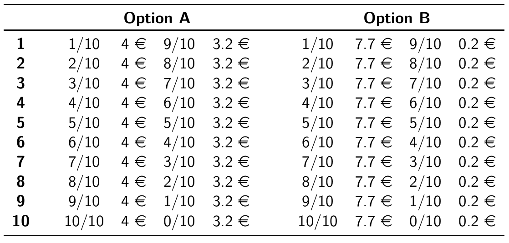
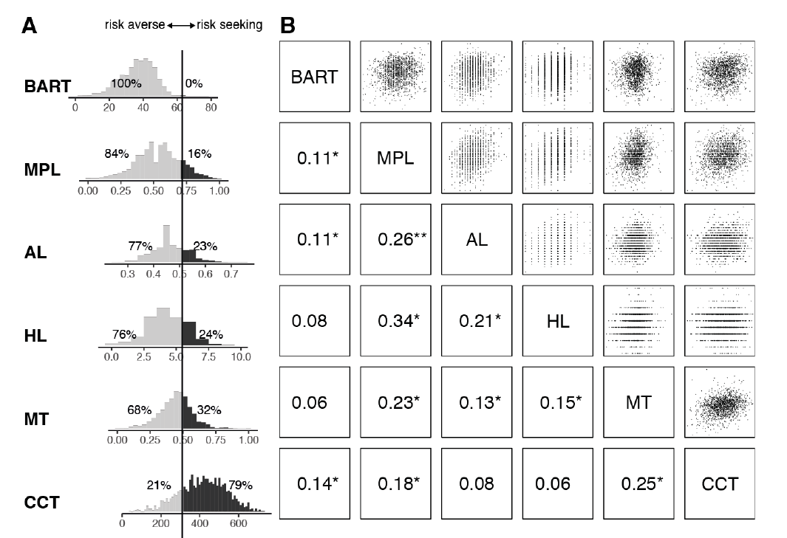
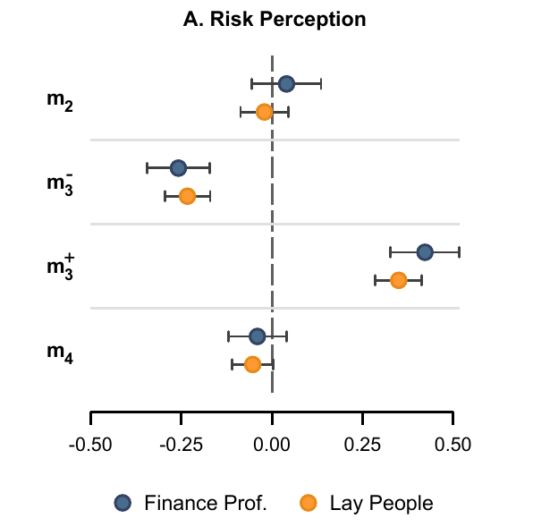

# Introduction


## Slovic (1962)

```{r setup, echo = F, message= F, warning=F}
knitr::opts_chunk$set(echo = F, warning = F, message = F, dev = "cairo_pdf")
library(tidyverse)
library(hrbrthemes)
library(Cairo)
theme_set(theme_ipsum_rc())
```


{width=800px}

> - *"...future research must carefully
consider the problem of adequately **defining** and
**assessing** risk taking behavior."*

# So, how are we doing?

## Measuring risk attitudes

> A **difficult** task with **crucial** relevance

- directly *unobservable*
- *latent* construct ($\Rightarrow$ requires a theory)
- should we..
  - *infer* from real world data or from *ad-hoc* choices
  - ask or **t**ask?
  - elicit by *descrption* or by *experience*?

> and by the way, what is our **objective**?

## The state of the art: psychology

> risk loosely defined as **probability of harm**

> focus on **questionnaires** and **intuitive tasks**

- **Quests**:
  - directly ask
  - over different domains
  - tackle risk perception

- **Tasks**
  - hand in cold water
  - card/gambling tasks
  
> Metrics of success: **convergent validity** + **predictive validity**

## The state of the art: economics

> risk formally defined as **uncertainty over outcomes**

> focus on **decontextualized tasks** (and *questionnaires*)

- **The lottery paradigm**
  - incentives
  - risk task = choice over lotteries
  - different formats, cover stories, contexts
  - strong theoretical underpinning
  - estimation of utility functions ($\Rightarrow$ models)
  
> Metric of success: **internal validity** (task $\iff$ theory)

## METARET: goals

- **Part 1: state of the art**
  - a *detailed map* of elicited risk attitudes
  - an assessment of *convergent validity*
  - an assessment of *predictive validity*
  
- **Part 2: moving forward**
  - theoretical: what are we measuring?
  - empirical: develop a better tool

## METARET resources

- **your** data (*thanks!*)

- preregistration on [OSF](https://osf.io/h2z56/)

- transparent data collection & analysis on [gitHub](https://github.com/paolocrosetto/METARET)

- live data exploration on a [shiny app](https://paolocrosetto.shinyapps.io/METARET/)
  
## Contributors so far (17.321 subjects)

- Gnambs Appel and Oeberst (PONE 2015)
- Crosetto and Filippin (EXEC 2016)
- Filippin and Crosetto (ManSci 2016)
- Pedroni Frey Bruhin Dutilh Hertwig and Rieskamp (NHB 2016)
- Menkhoff and Sakha (JEconPsy 2017)
- Frey Pedroni Mata Rieskamp and Hertwig (ScAdv 2017)
- Nielsen (JEBO 2019)
- Charness Garcia Offerman and Villeval (WP 2019)
- Holzmeister and Stefan (WP 2018)
- Zhou and Hey (ExEc 2018)
- Fairley Parelman Jones and McKell Carter (JEconPsy 2018)
- Csermely Rabas (JRU 2018)

# Elicited risk attitudes

## Holt and Laury

{width=800px}

## Binswanger / Eckel and Grossmann

<p align="center">
  {width=400px}
</p>

## Bomb Risk Elicitation Task

<p align="center">
  {width=600p}
</p>

## Investment Game (Gneezy and Potters)

<p align="center">
  {width=600px}
</p>


## Balloon Analog Risk Task (Lejuez et al)

<p align="center">
  {width=300px}
</p>

## Certainty Equivalent MPL

<p align="center">
  {width=350px}
</p>

## CRRA (à la Wakker)

<p align="center">
  <font size = "16"> $u(x) = x^r$ </font>
</p>

- simple
- captures risk aversion
- makes different tasks comparable


## How big are these differences?

```{r}
df <- tibble(x = seq(0.1,1,0.1)) %>% 
  mutate(y = 0.5*(100)^x)

ggplot(df, aes(x,y, label = round(y,1)))+
  geom_point()+
  geom_label(position = position_nudge(y = 4))+
  labs(x = "Risk aversion parameter of CRRA x^r",
       y = "certainty equivalent",
       title = "Certainty Equivalent of {0.5: 100; 0.5: 0} lottery",
       subtitle = "CRRA x^r")+
  scale_x_continuous(breaks = seq(0,1,0.1))
```

## Elicited attitudes: summary


- **low** consistency across tasks

- surprisingly, **low** consistency also *within* tasks

- but **heterogeneity** by task is large

- only result that holds: most people are *risk averse*

> possible explanation: between-subjects variation.

# Questionnaires

## Questionnaires: summary

- **better** consistency across samples

- a tendency to report *'in the middle'*

- we do not really know what those number mean

# Convergent validity: **correlations** among RETs

## Convergence: more evidence

{width=650px}

## Convergence: summary

- we replicate Slovic 1962 (!!)

- no correlation higher than .35

- when transalitng into r things get *worse*


# Predictive validity: correlation with questionnaires

## Predictive validity: more evidence

{width=700px}

## Predictive validity: summary

- **low** correlations with questionnaires

- across questionnaires and tasks

- Beauchamp et al JRU 2016: questionnaires are rather predictive


> **we have a problem**


# Why?

## Noise

> *noisy* preference + one-shot choices $\Rightarrow$ noisy data

- cognitive limits $\Rightarrow$ limited understanding

- *if* risk preferences fuzzy $\Rightarrow$ noisy estiamte

> solution: go **fully structural**

- Hey and Orme 1994
- Harrison and coauthors (several papers)

> forget quick & dirty task, embrace complexity

> Maximum Likelihood at the **individual** level

## Risk perception

{width=700px}


## Risk perception: a mismatch

- economists *assume* subjects share the same risk *definition*

- namely: 
  - risk as a distribution of **probability** over outcomes
  - $EV$ as the average across all possible states of the world
  - risk aversion as diminishing marginal utility of money
  - subjects care about **variance**

- but subjects think of risk as *probability of a loss*

> - *do subjects find our tasks risky?*

> - We **do not know** because we **assume** they do


## Experimenting on risk perception

- Holzmeister et al Working Paper
- gave description of return from an asset to subjects
- $\sim$7000 subjects 
- including $\sim$2500 **traders**
- asked to rate **perceived risk of each asset**

## Holzmeister et al: design

{width=630px}

## results - skewness

<p align="center">
{width=500px}
</p>

## results - aggregate risk measures

{width=800px}

# Roads ahead

## Theory

- Spiliopoulos & Hertwig: *different* **decision rules** for different contexts
- Schneider and Sutter: **higher moments** matter
- Sunder et al: *curvature of utility* function **not** a valid theory
- **Ergodicity** economics (peters et al): drop EV, use time-means
- ...


## Empirics

- use **meta-analysis** to find patterns 
  - do not aggregate *by task* but **by characteristic**
  - map what correlates and what doesn't

- tackle **noise** through 
  - binary chocies among lotteries
  - econometric modeling of noise
  - individual esitmates with MaxLik
  - iterate with Machine Learning to fid best lottery set
  
- tackle **perception** rather than assuming it away


## In a few words...

> - *"...future research must carefully
consider the problem of adequately **defining** and
**assessing** risk taking behavior."*

> - **exactly as in 1962**

# Thanks!

## Contribute to the meta-analysis!

**if**:

- you have **run a RET**
- you have run **more** than one
- you have run a RET and a **questionnaire**
- you have run a RET and another **risk-related measure**

> send your data -- paolo.crosetto@inra.fr

> github: (https://github.com/paolocrosetto/METARET)

> shiny app: (https://paolocrosetto.shinyapps.io/METARET/)
