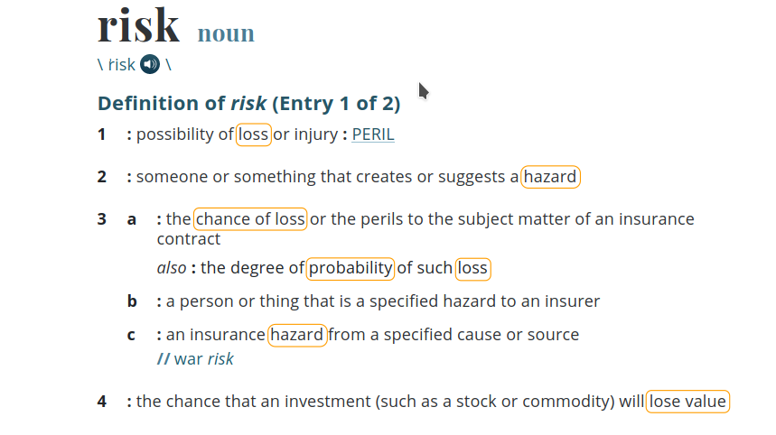
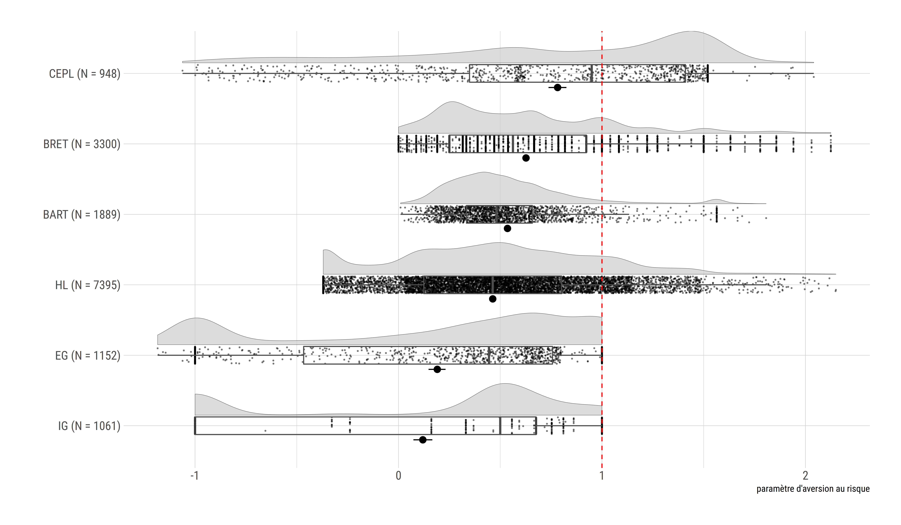

# Risk aversion & Pesticides

## What? 

> Research question: **accurate measure of the risk aversion of farmers**. 

## Why? 

- pesticides -> **lower variance** of returns from farming

- pesticides applied **before** pests arrive

- if farming is a lottery, pesticides reduce its volatility

- the higher the risk aversion, the higher the pesticide use

## What can we learn? 

> with a precise risk aversion measure...

1. estimation of **subjective costs** to farmers of cutting or eliminating pesticides; 
2. amount of pesticides that could be cut by **imposing the risk-neutral** pesticide use. 

## How? 

> State of the art in risk literature is **bad**

- low external validity
- low correlation with questionnaires
- low correlation with field behavior

## This project

> **develop new risk elicitation measure**

- takes into account **noise** & cognitive abilities
- takes into account risk **perception**
- possibly look for **other theories** than EU

- theory and lab experiments in progress (ANR RETRISK)
- **FAST: application to the field and farmers**

## Risk perception

{width=700px}

## Risk perception: a mismatch

- economists *assume* subjects share the same risk *definition*

- namely: 
  - risk as a distribution of **probability** over outcomes
  - $EV$ as the average across all possible states of the world
  - risk aversion as diminishing marginal utility of money
  - subjects care about **variance**

- but subjects think of risk as *probability of a loss*

> - *do subjects find our tasks risky?*

> - We **do not know** because we **assume** they do

## Have we got the right theory?

{width=800px}

## Have we got the right theory?

{width=800px}

## Other theories

- Spiliopoulos & Hertwig: *different* **decision rules** for different contexts
- Schneider and Sutter: **higher moments** matter
- Sunder et al: *curvature of utility* function **not** a valid theory
- **Ergodicity** economics (Peters et al): drop EV, use time-means
- ...

# Behavioral Moving Targets

## What? 

> **implement, test and propose a behavioral policy with an endogenously reducing target**

- e.g.: target is median pesticide use (t-1) - 10%

## Why? 

- bans or fixed thresholds can induce rigidities
- market fails (externalities)

> what about **endogenous moving targets**?
- leverage the impact of social norms for policy compliance & success
- endogenous targets could be more effective than exogenous
- used in the real world: Italian qualif', pay-what-you-want platforms

## What can we learn? 

A lot. We don't know much about

- heterogeneity of costs and externalities
- adjustment cost
- collusion-proof mechanisms

## How? 

1. extend the theory supporting this tool,(heterogeneity, adjustment costs, calbration); 
2. test the mechanism in lab experiments, especially its sensitivity to parameters, heterogeneity, adjustment cost;
3. test it in the field with actual farmers, and run calibration analysis for the parameters. 

