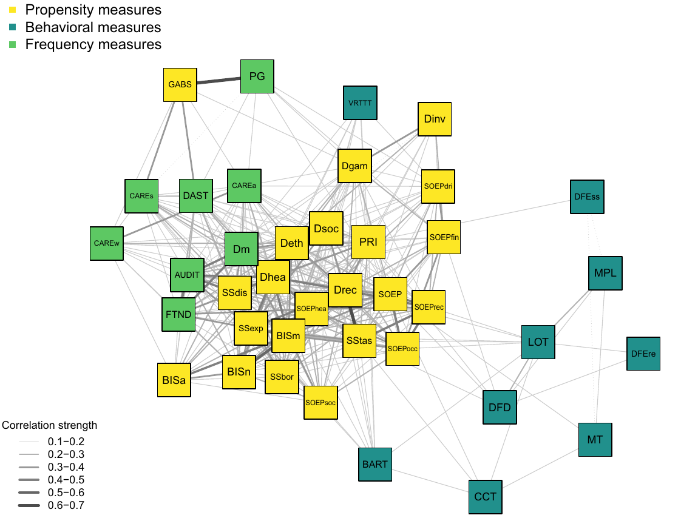
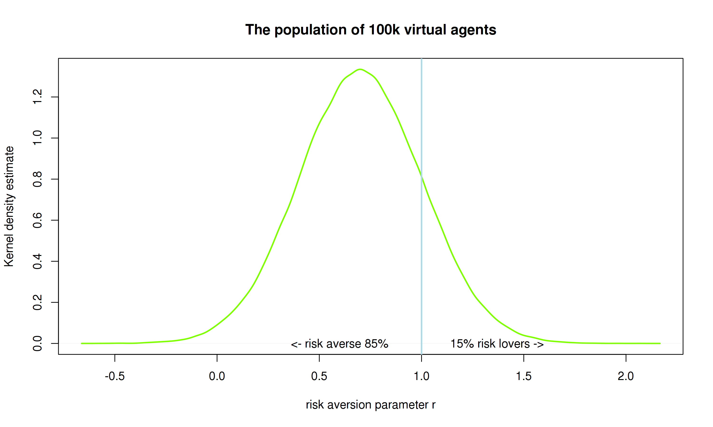
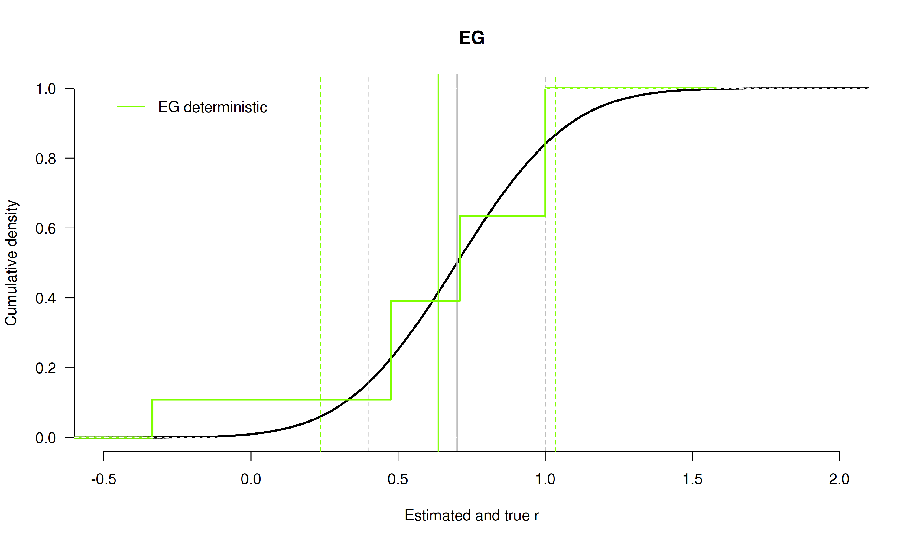
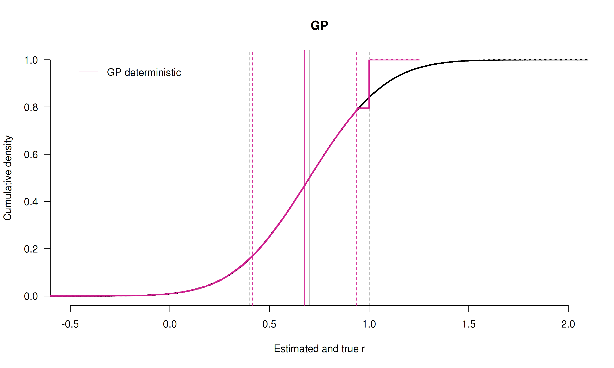
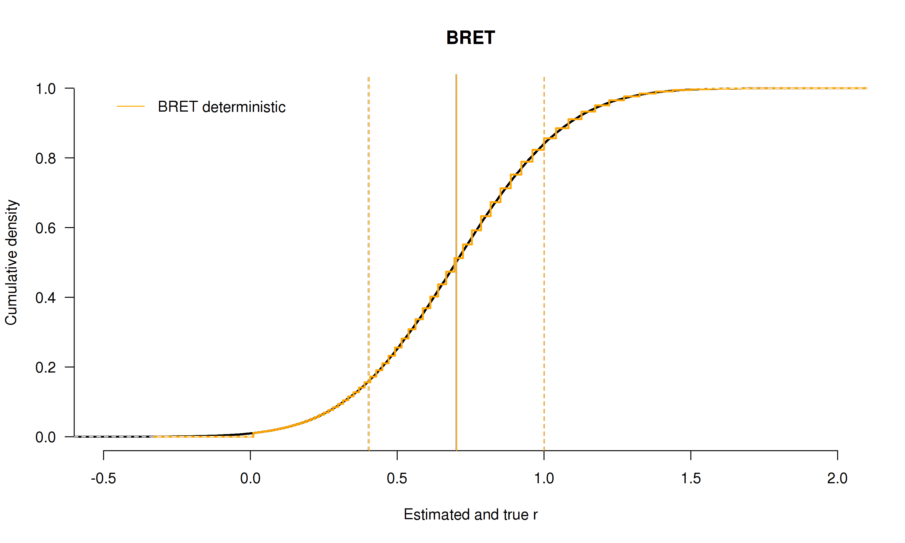
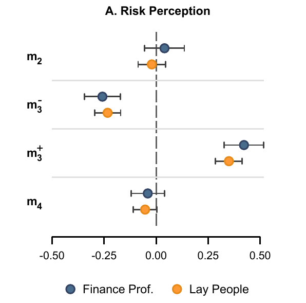

```{r setup, echo = F, message= F, warning=F}
knitr::opts_chunk$set(echo = F, warning = F, message = F, dev = "cairo_pdf")
library(tidyverse)
library(hrbrthemes)
library(Cairo)
theme_set(theme_ipsum_rc())
```

## What? 

> **Accurate measure of the risk aversion of farmers**. 

### Why? 

- pesticides -> **lower risk of loss** from farming

- pesticides applied **before** pests arrive

- if farming is a lottery, pesticides reduce its volatility

- the higher the risk (loss?) aversion, the higher the pesticide use

## What can we learn? 

> with a precise risk aversion measure...

1. estimation of **subjective costs** to farmers of cutting or eliminating pesticides; 
2. amount of pesticides that could be cut by **imposing the risk-neutral** pesticide use;
3. potential adjustment of **policy** to individual (or sector) risk attitudes.

## State of the art

> State of the art in risk literature is **far from optimal**

- despite experimental and empirical efforts, there are problems with the very concept of risk attitudes
- experimental methods currently used have shown low external validity
- low correlation with questionnaires & field behavior


## Goal 

> **Developing and testing in the field a new risk elicitation measure**

- takes into account **noise** & **cognitive abilities**
- takes into account risk **perception**

- theory and lab experiments in progress (ANR RETRISK)
- **FAST: application to the field and farmers**


# Deliverables

## Deliverables

1. a **Meta-analysis** of Risk Elicitation Tasks [mostly done]
2. an in-depth analysis of **noise** in risk elicitation [in progress]
3. an experiment on **risk perception** [to do]
4. given results of 1-3: a **field** experiments with farmers [completely to do]

## Meta-Analysis of Risk Elicitation Tasks

> **A meta-analysis of Risk elicitation tasks**

- elicited risk atitudes: tasks and questionnaires

- convergent validity: correlation among tasks 

- convergent validity: correlation among questionnaires

- predictive validity: correlation task $\iff$ questionnaires

## METARET resources

- preregistration on [OSF](https://osf.io/h2z56/)

- transparent data collection & analysis on [gitHub](https://github.com/paolocrosetto/METARET)

- live data exploration on a [shiny app](https://paolocrosetto.shinyapps.io/METARET/)
  
## Contributors (so far: 17.321 subjects)

- Gnambs Appel and Oeberst (PONE 2015)
- Crosetto and Filippin (EXEC 2016)
- Filippin and Crosetto (ManSci 2016)
- Pedroni Frey Bruhin Dutilh Hertwig and Rieskamp (NHB 2016)
- Menkhoff and Sakha (JEconPsy 2017)
- Frey Pedroni Mata Rieskamp and Hertwig (ScAdv 2017)
- Nielsen (JEBO 2019)
- Charness Garcia Offerman and Villeval (WP 2019)
- Holzmeister and Stefan (WP 2018)
- Zhou and Hey (ExEc 2018)
- Fairley Parelman Jones and McKell Carter (JEconPsy 2018)
- Csermely Rabas (JRU 2018)


# 4. Predictive validity

## Predictive validity: more evidence

<p align="center">
{width=700px}
</p>

## Predictive validity: summary

- **low** correlations with questionnaires

- across questionnaires and tasks

- Beauchamp et al JRU 2016: questionnaires are rather predictive


# We have a problem


## Finding one's way

- **task-specific bias**

- (noise)

- **risk perception**

- (theory)

# Noise

## noise, 1: what if tasks distort choices?

> *noisy* preference + one-shot choices $\Rightarrow$ noisy data

- cognitive limits $\Rightarrow$ limited understanding

- *task-specific* bias?

<p align="right">
(this work: Crosetto and Filippin, ExEc 2015)
</p>

## 
<p align="center">
{width=800px}
</p>


## Simulations

**How does the mere mechanics of each task affect the outcome?**


Simulation exercise:

- generate 100k virtual agents
- for each agent, $r\sim N(0.7,0.3)$
- let the agents play each of the 4 tasks
- collect results, run statistics
- analyze the retrieved $\hat{r}$
 
A good task should be able to **recreate the starting distribution**, if no error.

## Deterministic vs noisy

**3 types of simulations**:

- deterministic

- random parameter model $\Rightarrow$ models fuzzy preferences
  - for each agent, $r = r_0 + \varepsilon, \; \varepsilon \sim \mathcal{N}(0,\mu)$
  - $\mu \in (0.3;0.6)$

- random agents $\Rightarrow$ models frame effects
  - 10% of subjects act randomly on the space of the task
  

## Starting distribution
<p align="center">
{width=800px}
</p>


## HL
<p align="center">
{width=800px}
</p>

## HL
<p align="center">
{width=800px}
</p>

## HL
<p align="center">
{width=800px}
</p>

## EG

<p align="center">
{width=800px}
</p>

## EG

<p align="center">
{width=800px}
</p>

## EG

<p align="center">
{width=800px}
</p>

## GP

<p align="center">
{width=800px}
</p>

## GP

<p align="center">
{width=800px}
<p>

## GP

<p align="center">
{width=800px}
</p>


## BRET

<p align="center">
{width=800px}
</p>


## BRET

<p align="center">
{width=800px}
</p>


## BRET

<p align="center">
{width=800px}
</p>

## Task-specific summary

> is there a task-specific bias? **yes**

> does it account for all differences? **no**

> is this the only way to take noise into account? **no**

# Risk perception

## Risk perception


{width=700px}


## Risk perception: a mismatch

- economists *assume* subjects share the same risk *definition*

- namely: 
  - risk as a distribution of **probability** over outcomes
  - $EV$ as the average across all possible states of the world
  - risk aversion as diminishing marginal utility of money
  - subjects care about **variance**

- but subjects think of risk as *probability of a loss*

> - *do subjects find our tasks risky?*

> - We **do not know** because we **assume** they do


## Experimenting on risk perception

- Holzmeister et al Working Paper
- gave description of return from an asset to subjects
- $\sim$ 7000 subjects 
- including $\sim$ 2500 **traders**
- asked to rate **perceived risk of each asset**

## Holzmeister et al: design

<p align="center">
{width=630px}
</p>

## results - skewness

<p align="center">
{width=500px}
</p>

## results - aggregate risk measures

<p align="center">
{width=800px}
</p>

# Theory

## Have we got the right theory?

<p align="center">
{width=800px}
</p>


## Have we got the right theory?

<p align="center">
{width=800px}
</p>


