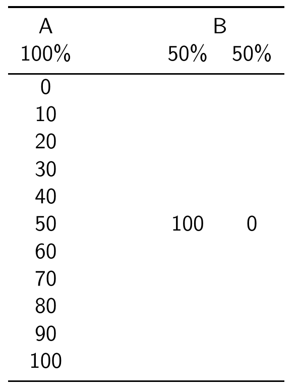
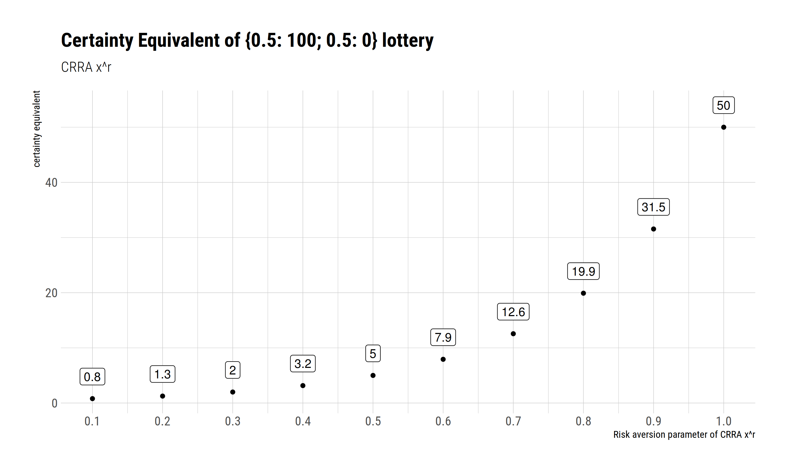
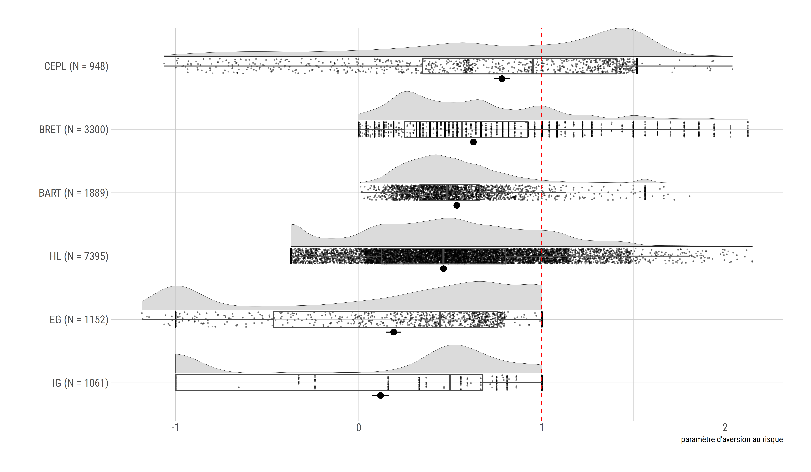

```{r setup, include=FALSE}
options(htmltools.dir.version = FALSE)
knitr::opts_chunk$set(echo = F, warning = F, message = F, dev = "cairo_pdf")
library(tidyverse)
library(hrbrthemes)
library(Cairo)
theme_set(theme_ipsum_rc())
```

class: center, middle

---

# Slovic (1962)


<p align="center">
{width=800px}
</p>

> - *"...future research must carefully
consider the problem of adequately **defining** and
**assessing** risk taking behavior."*

---

# So, how are we doing?

## This talk

- **Part 1: a destination**
  - what are risk attitudes?
  - how do we measure them?


- **Part 2: a map**
  - a *detailed map* of elicited risk attitudes
  - an assessment of *convergent* and *predictive* validity*
  
  
- **Part 3: finding one's way**
  - task-specific bias
  - risk perception
  
# I. destination: risk attitudes

## Measuring risk attitudes

> A **difficult** task with **crucial** relevance

- directly *unobservable*
- *latent* construct ($\Rightarrow$ requires a theory)
- should we..
  - *infer* from real world data or from *ad-hoc* choices
  - ask or **t**ask?
  - elicit by *descrption* or by *experience*?

> and by the way, what is **risk**?

## 

{width=800px}

## Risk in psychology

> The act of implementing a goal-directed option qualifies as an instance of risk taking whenever **two things** are true: (a) the behavior in question could lead to **more than one outcome** and (b) some of these outcomes are **undesirable** 	or even dangerous. In essence, then, risk taking involves the implementation of options that could lead to **negative** consequences. 

(*Byrnes et al 1999*)

## The state of the art: psychology

> risk loosely defined as **probability of harm**

> focus on **questionnaires** and **intuitive tasks**

- **Quests**:
  - directly ask
  - over different domains
  - tackle risk perception

- **Tasks**
  - putting the subject in a 'risky' situation
  - card/gambling tasks
  
> Metrics of success: **convergent validity** + **predictive validity**

## Risk in economics

> decisions given a **probability distribution** over **outcomes**

- if probability and outcomes known: **risk**

- if only oucomes known: **ambiguity**

- if both unknown: knightian **uncertainty**

## The EUT framework

<p align="center">
{width=500px}
</p>


## The EUT framework

<p align="center">
{width=500px}
</p>

## The EUT framework

<p align="center">
{width=500px}
</p>

## The EUT framework

<p align="center">
{width=500px}
</p>

## The state of the art: economics

> risk formally defined as **uncertainty over outcomes**

> focus on **decontextualized tasks** (and *questionnaires*)

- **The lottery paradigm**
  - incentives
  - risk task = choice over lotteries
  - different formats, cover stories, contexts
  - strong theoretical underpinning
  - estimation of utility functions ($\Rightarrow$ models)
  
> Metric of success: **internal validity** (task $\iff$ theory)


# Tools: RETs


## Holt and Laury

<p align="center">
{width=800px}
</p>

## Binswanger / Eckel and Grossmann

<p align="center">
  {width=400px}
</p>

## Bomb Risk Elicitation Task

<p align="center">
  {width=600p}
</p>

## Investment Game (Gneezy and Potters)

<p align="center">
  {width=600px}
</p>


## Balloon Analog Risk Task (Lejuez et al)

<p align="center">
  {width=300px}
</p>

## Certainty Equivalent MPL

<p align="center">
  {width=350px}
</p>


## Questionnaire: SOEP

**How likely are you to take risks in general, one a scale from 0 (not taking any risks) to 10 (taking many risks)?**

## Questionnaire: DOSPERT

**Do**main **Spe**cific **R**isk **T**aking Scale

- 6 domains: investing, gambling, health/safety, recreational, ethical, and social
- 1 to 7 scale: *how risky do you think X is?*
- 1 to 7 scale: *how likely are you to engage in X?*


Examples:

- Riding a motorcycle without a helmet.
- Engaging in unprotected sex. 
- Investing 10\% of your annual income in a moderate growth diversified fund.


# II. a map: METARET

## METARET

> **A meta-analysis of Risk elicitation tasks**

- elicited risk atitudes: tasks and questionnaires

- convergent validity: correlation among tasks 

- convergent validity: correlation among questionnaires

- predictive validity: correlation task $\iff$ questionnaires

## METARET resources

- **your** data (*thanks!*)

- preregistration on [OSF](https://osf.io/h2z56/)

- transparent data collection & analysis on [gitHub](https://github.com/paolocrosetto/METARET)

- live data exploration on a [shiny app](https://paolocrosetto.shinyapps.io/METARET/)
  
## Contributors (so far: 17.321 subjects)

- Gnambs Appel and Oeberst (PONE 2015)
- Crosetto and Filippin (EXEC 2016)
- Filippin and Crosetto (ManSci 2016)
- Pedroni Frey Bruhin Dutilh Hertwig and Rieskamp (NHB 2016)
- Menkhoff and Sakha (JEconPsy 2017)
- Frey Pedroni Mata Rieskamp and Hertwig (ScAdv 2017)
- Nielsen (JEBO 2019)
- Charness Garcia Offerman and Villeval (WP 2019)
- Holzmeister and Stefan (WP 2018)
- Zhou and Hey (ExEc 2018)
- Fairley Parelman Jones and McKell Carter (JEconPsy 2018)
- Csermely Rabas (JRU 2018)


## Assumptions: CRRA (à la Wakker)

<p align="center">
  <font size = "16"> $u(x) = x^r$ </font>
</p>

- simple
- captures risk aversion
- makes different tasks comparable


## CRRA

<p align="center">
{width=450px}
<p>

## How big are the differences?

<p align="center">
{width=800px}
</p>


# 1. elicited attitudes

## elicited attitudes: summary


- **low** consistency across tasks

- surprisingly, **low** consistency also *within* tasks

- but **heterogeneity** by task is large

- only result that holds: most people are *risk averse*

> possible explanation: between-subjects variation.

# 2. Questionnaires

## Questionnaires: summary

- **better** consistency across samples

- a tendency to report *'in the middle'*

- we do not really know what those numbers mean


# 3. Convergent validity

## Convergence: more evidence

<p align="center">
{width=650px}
</p>

## Convergence: summary

- we replicate Slovic 1962 (!!)

- no correlation higher than .35

- when transalitng into r things get *worse*


# 4. Predictive validity

## Predictive validity: more evidence

<p align="center">
{width=700px}
</p>

## Predictive validity: summary

- **low** correlations with questionnaires

- across questionnaires and tasks

- Beauchamp et al JRU 2016: questionnaires are rather predictive


# We have a problem


# III. finding one's way

## Finding one's way

- task-specific bias

- noise

- risk perception

- theory

## Finding one's way

- **task-specific bias**

- (noise)

- **risk perception**

- (theory)

# Task-specfic bias

## what if tasks distort choices?

> *noisy* preference + one-shot choices $\Rightarrow$ noisy data

- cognitive limits $\Rightarrow$ limited understanding

- *task-specific* bias?

<p align="right">
(this work: Crosetto and Filippin, ExEc 2015)
</p>

## 
<p align="center">
{width=800px}
</p>


## Simulations

**How does the mere mechanics of each task affect the outcome?**


Simulation exercise:

- generate 100k virtual agents
- for each agent, $r\sim N(0.7,0.3)$
- let the agents play each of the 4 tasks
- collect results, run statistics
- analyze the retrieved $\hat{r}$
 
A good task should be able to **recreate the starting distribution**, if no error.

## Deterministic vs noisy

**3 types of simulations**:

- deterministic

- random parameter model $\Rightarrow$ models fuzzy preferences
  - for each agent, $r = r_0 + \varepsilon, \; \varepsilon \sim \mathcal{N}(0,\mu)$
  - $\mu \in (0.3;0.6)$

- random agents $\Rightarrow$ models frame effects
  - 10% of subjects act randomly on the space of the task
  

## Starting distribution
<p align="center">
{width=800px}
</p>


## HL
<p align="center">
{width=800px}
</p>

## HL
<p align="center">
{width=800px}
</p>

## HL
<p align="center">
{width=800px}
</p>

## EG

<p align="center">
{width=800px}
</p>

## EG

<p align="center">
{width=800px}
</p>

## EG

<p align="center">
{width=800px}
</p>

## GP

<p align="center">
{width=800px}
</p>

## GP

<p align="center">
{width=800px}
<p>

## GP

<p align="center">
{width=800px}
</p>


## BRET

<p align="center">
{width=800px}
</p>


## BRET

<p align="center">
{width=800px}
</p>


## BRET

<p align="center">
{width=800px}
</p>

## Task-specific summary

> is there a task-specific bias? **yes**

> does it account for all differences? **no**

> is this the only way to take noise into account? **no**

# Risk perception

## Risk perception


{width=700px}


## Risk perception: a mismatch

- economists *assume* subjects share the same risk *definition*

- namely: 
  - risk as a distribution of **probability** over outcomes
  - $EV$ as the average across all possible states of the world
  - risk aversion as diminishing marginal utility of money
  - subjects care about **variance**

- but subjects think of risk as *probability of a loss*

> - *do subjects find our tasks risky?*

> - We **do not know** because we **assume** they do


## Experimenting on risk perception

- Holzmeister et al Working Paper
- gave description of return from an asset to subjects
- $\sim$ 7000 subjects 
- including $\sim$ 2500 **traders**
- asked to rate **perceived risk of each asset**

## Holzmeister et al: design

<p align="center">
{width=630px}
</p>

## results - skewness

<p align="center">
{width=500px}
</p>

## results - aggregate risk measures

<p align="center">
{width=800px}
</p>

# Theory

## Have we got the right theory?

<p align="center">
{width=800px}
</p>


## Have we got the right theory?

<p align="center">
{width=800px}
</p>


## Other theories

- Spiliopoulos & Hertwig: *different* **decision rules** for different contexts
- Schneider and Sutter: **higher moments** matter
- Sunder et al: *curvature of utility* function **not** a valid theory
- **Ergodicity** economics (Peters et al): drop EV, use time-means
- ...


## Summing up...

> - *"...future research must carefully
consider the problem of adequately **defining** and
**assessing** risk taking behavior."*

> - **exactly as in 1962**

# Thanks!

## Contribute to the meta-analysis!

**if**:

- you have **run a RET**
- you have run **more** than one
- you have run a RET and a **questionnaire**
- you have run a RET and another **risk-related measure**


**then**:

> send your data -- paolo.crosetto@inra.fr

> github: (https://github.com/paolocrosetto/METARET)

> shiny app: (https://paolocrosetto.shinyapps.io/METARET/)


