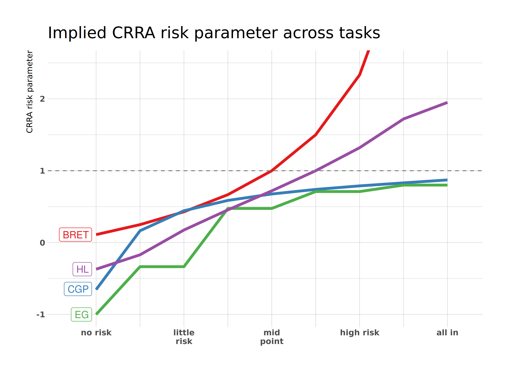

```{r setup, include=FALSE}
knitr::opts_chunk$set(
	echo = FALSE,
	message = FALSE,
	warning = FALSE,
	dpi = 300,
	out.width = "80%",
	dev.args=list(bg="transparent")
)
```

```{r packages}
library(InraeThemes)
library(gt)
```


```{r setup2, echo = F, message= F, warning=F}
knitr::opts_chunk$set(echo = F, warning = F, message = F, dev = "cairo_pdf")
library(tidyverse)
library(hrbrthemes)
library(Cairo)
theme_set(theme_ipsum_rc())
```

# The contribution

## What? 

> **Accurate measure of the risk aversion (of farmers)**. 

### Why? 

- pesticides -> **lower risk of loss** from farming

- pesticides applied **before** pests arrive

- if farming is a lottery, pesticides reduce its volatility

- the higher the risk (loss?) aversion, the higher the pesticide use

## What can we learn? 

> with a precise risk aversion measure...

1. estimation of **subjective costs** to farmers of cutting or eliminating pesticides; 
2. amount of pesticides that could be cut by **imposing the risk-neutral** pesticide use;
3. potential adjustment of **policy** to individual (or sector) risk attitudes.

## State of the art

> State of the art in risk literature is **far from optimal**

- despite experimental and empirical efforts, there are problems with the very concept of risk attitudes
- experimental methods currently used have shown low external validity
- low correlation with questionnaires & field behavior


## Goal 

> **Developing and testing in the field a new risk elicitation measure**

- takes into account **noise** & **cognitive abilities**
- takes into account risk **perception**

- theory and lab experiments in progress (ANR RETRISK)
- **FAST: application to the field and farmers**


# Deliverables

## Deliverables

1. a **Meta-analysis** of Risk Elicitation Tasks [mostly done]
2. an in-depth analysis of **noise** in risk elicitation [in progress]
3. an experiment on **risk perception** [to do]
4. given results of 1-3: a **field** experiments with farmers [completely to do]

# Meta-Analysis

## METARET

> **A meta-analysis of Risk elicitation tasks**

- elicited risk atitudes: tasks and questionnaires

- convergent validity: correlation among tasks 

- convergent validity: correlation among questionnaires

- predictive validity: correlation task $\iff$ questionnaires

## METARET resources

- preregistration on [OSF](https://osf.io/h2z56/)

- transparent data collection & analysis on [gitHub](https://github.com/paolocrosetto/METARET)

- live data exploration on a [shiny app](https://paolocrosetto.shinyapps.io/METARET/)
  
## Contributors (so far: 17.321 subjects)

- Gnambs Appel and Oeberst (PONE 2015)
- Crosetto and Filippin (EXEC 2016)
- Filippin and Crosetto (ManSci 2016)
- Pedroni Frey Bruhin Dutilh Hertwig and Rieskamp (NHB 2016)
- Menkhoff and Sakha (JEconPsy 2017)
- Frey Pedroni Mata Rieskamp and Hertwig (ScAdv 2017)
- Nielsen (JEBO 2019)
- Charness Garcia Offerman and Villeval (WP 2019)
- Holzmeister and Stefan (WP 2018)
- Zhou and Hey (ExEc 2018)
- Fairley Parelman Jones and McKell Carter (JEconPsy 2018)
- Csermely Rabas (JRU 2018)


# The role of noise


## noise, 1: what if tasks distort choices?

> *noisy* preference + one-shot choices $\Rightarrow$ noisy data
<p align="right">
(this work: Crosetto and Filippin, ExEc 2015)
</p>

- cognitive limits $\Rightarrow$ limited understanding

- *task-specific* bias?


## 
<p align="center">
{width=800px}
</p>


## noise, 2: what if preferences are not stable?

<p align="right">
(this work: joint with Paul Bettega (PhD), experiments done)
</p>

- subjects repeat a balloon-type risk task **100 times**
- are they consistent? is there a stable mean? 
- can we predict subjects' later choices from earlier ones? 

> by and large, very **little* stability; noise is mostly **not** normal


# Risk perception

## Risk perception


{width=700px}


## Risk perception: a mismatch

- economists *assume* subjects share the same risk *definition*

- namely: 
  - risk as a distribution of **probability** over outcomes
  - $EV$ as the average across all possible states of the world
  - risk aversion as diminishing marginal utility of money
  - subjects care about **variance**

- but subjects think of risk as *probability of a loss*

> *do subjects find our tasks risky?*

> We **do not know** because we **assume** they do


## Risk perception: an abstract task

> Still heavily Work in Progress

> key ingredients
- a robust way to elicit perceptions
- a robust way to integrate perception into structural modeling

# Farmers

## Still completely todo... but

- apply risk perception to the pesticides context (as Douadia does)
- expose farmers to the abstract tasks developed above and check correlations
- focus on external validity and production data to cross-validate the measure


