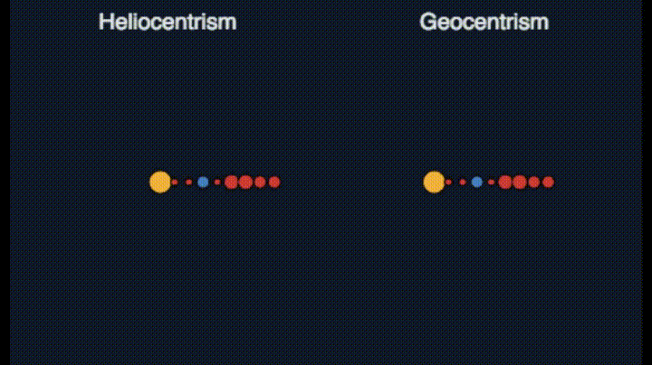

# Les attitudes face au risque {data-background=#008C56}

## le risque en français

{width=800px}

# Nos amis les psychologues {data-background=#008C56}

## Le risque en psychologie

> The act of implementing a goal-directed option qualifies as an instance of risk taking whenever **two things** are true: (a) the behavior in question could lead to **more than one outcome** and (b) some of these outcomes are **undesirable** 	or even dangerous. In essence, then, risk taking involves the implementation of options that could lead to **negative** consequences. 

(*Byrnes et al 1999*)

## Elicitation des attitudes face au risque en psychologie

> risque: ~probabilité de perte

> élicitation: questionnaires et tâches pratiques 
  
> Mesure du succès: cohérence intra-personnelle + prédictions

## Questionnaire: SOEP

**En général, est-ce que voue êtes une personne qui prend des risques, sur une échelle de 0 (aucun risque) à 10 (tous les risques)?**

## Questionnaire: DOSPERT

**Do**main **Spe**cific **R**isk **T**aking Scale

- 6 domaines: investissement, jeux de hasard, santé, loisirs, éthique, social
- dimension prise de risque: *quelle est la probabilité que vous fassiez l'activité X?*
- dimension perception: *est-ce que vous pensez que l'activité X est risquée?*

Exemples:

- rouler à moto sans casque
- avoir des rapports sexuels non protégés
- investir 10% de votre patrimoine sur le marché actionnaire

## et... ça marche?

> globalement, oui

- bonne performance dans des sit/resit
- pouvoir prédictif correct
- quesitonnaires utilisés également dans la pratique clinique

# Nous les économistes {data-background=#008C56}

## Le risque en économie

> toute décision parmi des événements possibles

- si les probabilités sont connues: **risque**

- si uniquement les événements sont connus: **ambiguité**

- si rien n'est connu: **incertitude** de Knight

> pas de notion de perte ou de danger -- juste un cas particulier

## Elicitation des attitudes face au risque en psychologie

> risque: ~distribution de probabilité sur des événements

> élicitation: tâches incitées avec des conséquences monétaires

> cadre théorique: plusieurs, mais de base Utilité Espérée
  
> Mesure du succès: validité interne (colle à la théorie) + validité externe (prédictions)

## La théorie de l'utilité espérée

{width=500px}

## La théorie de l'utilité espérée

{width=500px}

## La théorie de l'utilité espérée

{width=500px}

## La théorie de l'utilité espérée

{width=500px}

## Tâches incitées d'élicitation

> le paradigme de la loterie

{width=500px}

  

## Holt and Laury

{width=800px}

## Binswanger / Eckel and Grossmann

  {width=400px}

## Bomb Risk Elicitation Task (Crosetto & Filippin)

  {width=600p}

## Jeu d'investissement (Gneezy and Potters)

  {width=600px}

## Equivalent certain (Adellaoui)

  {width=350px}

## et... ça marche?

> globalement, non

- on ne connaît pas trop la performance dans des sit/resit
- pouvoir prédictif assez faible
- tâches pas utilisés en pratique (banques, assurance...)

##

  {width=600px}

## Hors blague

> Biais hypothétique

> Sans théorie, on ne va pas loin. L'approche éco a du sens

- obtenir un paramètre pour les attitudes face au risque permet:
  - de l'utiliser dans des modèles de décision
  - de l'appliquer dans plusieurs contextes (assurance, investissement)
  - de bâtir d'autres théories
  
...tout compte fait, le vieux débat sur le réductionisme

# METARET -- une Méta Analyse des Tâches d'élicitation du risque {data-background=#008C56}

## Le projet (ANR RETRISK)

- une *méta-analyse* des atttiudes face au risque en éco expé

- une *collecte de données* au sein de la communauté

- une réponse complète et définitive à la question: "*et alors ça marche?*"

- un **site** de documentation (enseignement/recherche) [Liza Golovanova]

- une **exploration** de différentes hypothèses sur le fonctionnement

- (à l'horizon: la proposition d'une nouvelle méthode d'élicitation)

## Le site

## Et ça veut dire quoi?

{width=800px}

## Et alors, pourquoi ça ne marche pas? 

## Et alors, pourquoi ça ne marche pas? 

> je ne sais pas 

## Et alors, pourquoi ça ne marche pas? 

> je ne sais pas (pour le moment)

## Et alors, pourquoi ça ne marche pas? 

> je ne sais pas (pour le moment)... MAIS:

- projet ANR RETRISK
- projer Risque à l'intérieur de FAST
- pistes:
  - bruit (variation intra-personnelle) [thèse de Paul]
  - perception du risque
  - a-t-on la bonne théorie? 

## A-t-on la bonne théorie?

{width=800px}

# des questions? {data-background=#FFA07A}
