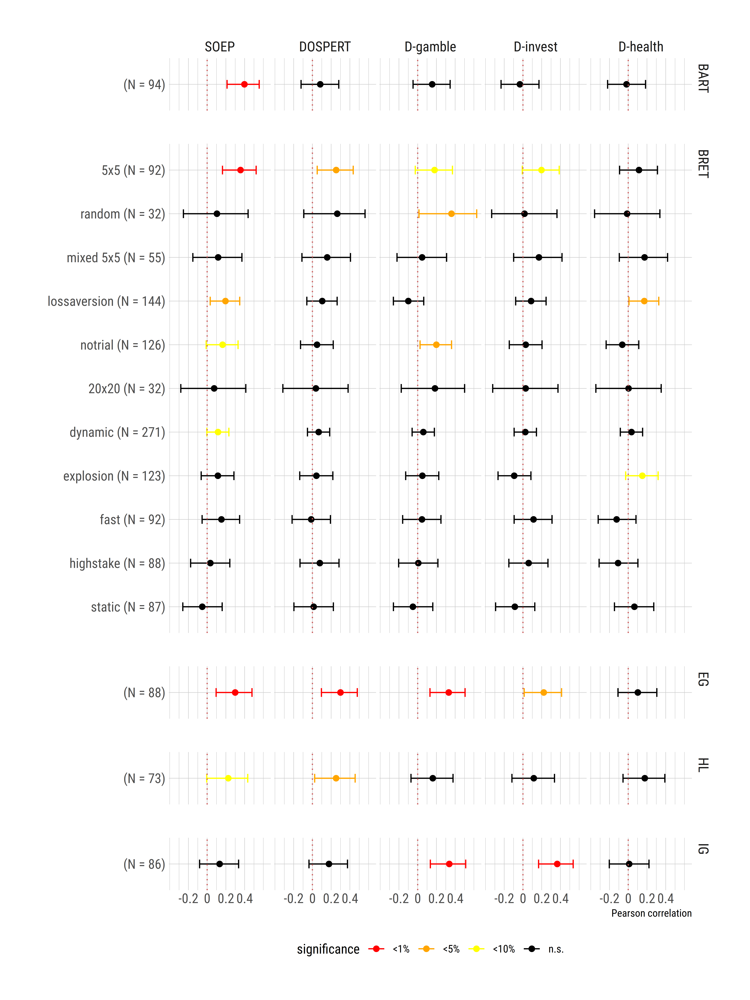

METARET – a Meta Analysis of the External Validity of Risk Elicitation
Tasks
================
Paolo Crosetto
This version: June 2019

This repository hosts all the development files of the METARET project
on the **external validity** of **risk elicitation tasks** (RETs) –
i.e. their ability to predict self-reported or real-world behavior.

## Aim of the project

The accurate measure of **risk preferences** is of large importance in
both theoretical and applied work. Despite this importance, increasing
experimental evidence points to the fact that the behavioral measures we
use to elicit risk attitudes have **low external validity**.

Lottery-based risk elicitation tasks (*RETs*), at least in the way they
are typically implemented in behavioral economics and psychology, 1.
**correlate poorly** with self-reported risk attitudes, real-world risk
behaviors, and among themselves; 2. introduce distinct **measurement
errors** and behavioral biases, and 3. are not robust to **test-retest**
exercises.

But the issue can not be settled by a handful of papers, that despite
all efforts are limited in sample size, and types of task and
questionnaires considered.

The good news is that the **data** to assess the external validity of a
large variety of RETs and a large variety of self-reported
questionnaires **already exists**. It sits in the drawers of dozens of
experimentlasits that have used RETs for their disparate aims. If
collected, the *existing data* would give us a detailed, precise, and
extensive **map of the external validity** of RETs under a variety of
experimental conditions.

The aim of METARET – the Meta-analysis of the external validity of RETs
– is to collect in a single, public, open repository all the data
pertaining to the external validity of RETs. Its objectives are to

  - **document exhaustively** the scope and limits of the external
    validity of different RETs.
  - provide a **detailed map** of which **features** of a RET are more
    conducive to external validity validity.
  - serve as a basis for the **development** of a more predictive
    lottery-based RET (*French ANR grant under submission*).

METARET will collect data of papers that have run:

  - any **lottery-based RET** (incentivized or not)
  - any **other measure of risk** attitudes (questionnaire, bids in an
    auction, self-reported, implied by behavior in another game
    (insurance, trust…))
  - any **self-declared real-world risky behaviour**.

The **metric** of interest will be (linear and rank) **correlations**
between any two RETs, any RET and any questionnaire, any RET and any
real-world behavior. For lottery-based RETs, *two* metrics will be used:
**bare choices** – whose domain and granularity change across tasks –
and **implied CRRA coefficients** of risk attitudes *r* – that are
burdened by theoretical assumptions but are more comparable across
tasks.

The aim is to be as **inclusive** as possible, to allow the map to cover
most possible ground – data availability will impose us to restrict
attention to certain broad class of RETs and of self-reported measures
in due time.

## Resources

METARET is composed of:

  - a **shiny interactive app**
    [(here)](https://paolocrosetto.shinyapps.io/METARET/) where the data
    accumulated so far can be explored and visualised;
  - an **OSF page** [(here)](https://osf.io/h2z56/) where the project is
    being pre-registered;
  - this **github repository** where the real work is done and updated,
    and that contains
      - **data** from each of several *contributed papers* by
        experimental economists and social psychologists.
      - **code** to format each original dataset into a common format
        for later analysis
      - **results** in the form of plots and tables (*work in progress*)
      - **code** for the interactive shiny app (*work in progress*)

## How to contribute

METARET is about **correlations**. So data need to be collected *within
subjects*. If you have experimental data that includes:

  - two (or more) lottery-based **RETs**
  - one (or more) RETs and one (or more) self-reported
    **questionnaires** (SOEP, DOSPERT, sensation seeking, other scales)
  - one (or more) questionnaires or RET and **risk-related behavior** in
    another game/task (insurance, trust, strategic uncertainty,
    contests, competitiveness…)
  - one (or more) RET or questionnaire and self-reported **real world
    risk attitudes** (health, sports, sexual behavior, smoking…)

then your data can be included in METARET.

To contribute:

  - open a **git pull request** and push your data to the /Data folder,
    in an appropriately named subfolder;
  - **send your raw data** (limited to the RET, questionnaires,
    risk-behavior data, subject ID) and a codebook to
    <paolo.crosetto@gmail.com> and I will upload it to this repository
    and the shiny app. Send along also the **published paper** that is
    based on that data, as well as any detail about the RET, the
    questionnaire, the sample that you might find relevant;
  - **compute by yourself the correlations** and send them to
    <paolo.crosetto@gmail.com>

### Data dissemination and disclosure

This is an **open science project**. All data shared will be **made
public**. It will be available for external scrutiny, download, and
further use (upon citation and contact, CC NC-BY-SA):

  - *static .csv files* and analysis scripts (mainly R and Stata), on
    this **github** repository;
  - *dynamically explorable*, on the [shiny
    app](https://paolocrosetto.shinyapps.io/METARET/).

If **you do not wish** your raw data to be disclosed but *still want to
contribute*, let me know. It is possible to include only the computed
correlations to the shiny app and the meta-analysis plots *without*
fully disclosing the individual data. Of course, with individual data
more is possible (distribution plots, large scatter plots, computation
of different utility functions, more measures…)

### Open science

METARET will be **developed in public**. As new papers and data sources
arrive, they will be added to the repository, cleaned, correlations will
be computed, and results will be fed to the [shiny
app](https://paolocrosetto.shinyapps.io/METARET/). You will be able to
**track** the active development of the meta-analysis.

### Presentation

The methodology and first results of METARET will be the object of a
special [semi-pleanry
session](https://lessac.bsb-education.com/index.php?page=plenary)
organized by me at the [2019 Dijon European ESA
meeting](https://lessac.bsb-education.com/index.php?page=european-esa-meeting-dijon-sept-2019).
Pop by Dijon to learn more.

## Contributed papers (list updates as papers are contributed)

In order to give a feeling of the final product, METARET started from
two papers of mine. More papers whose data is freely available for
download will be soon added.

  - Crosetto, Paolo, and Filippin, Antonio, *The Bomb Risk Elicitation
    Task*, JRU, 2013
    [paper](https://link.springer.com/article/10.1007/s11166-013-9170-z)
    [data](/Data/Crosetto_Filippin_Experimental_Economics_2016)
  - Crosetto, Paolo, and Filippin, Antonio, *A Theoretical and
    Experimental Appraisal of Four Risk ELicitation Methods*, ExEc, 2016
    [paper](https://link.springer.com/article/10.1007/s10683-015-9457-9)
    [data](/Data/Crosetto_Filippin_Journal_Risk_Uncertainty_2013/)

### First look at the results

As a first step, I compute the (Pearson) correlation of each RET to
(each of a series of) self-reported risk measures.

Each task is represented by a point estimate + confidence interval. Here
are the results of correlations between several tasks and:

  - the SOEP risk question
  - the DOSPERT scale and its subscales

The plots and analyses are updated for each new contributed paper. An
interactive version fo the same data is to be found at the [shiny
app](https://paolocrosetto.shinyapps.io/METARET/)

<!-- -->
