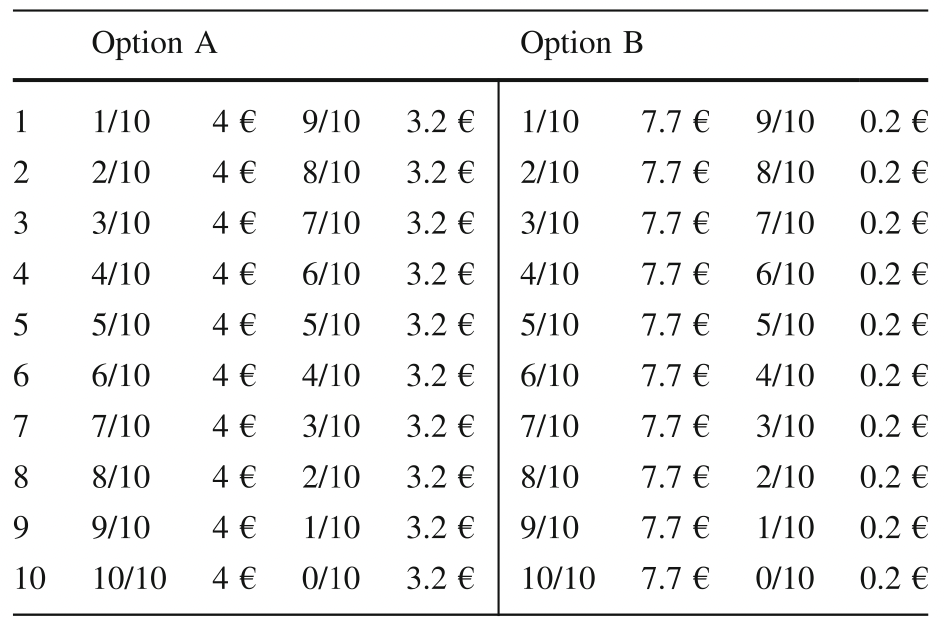
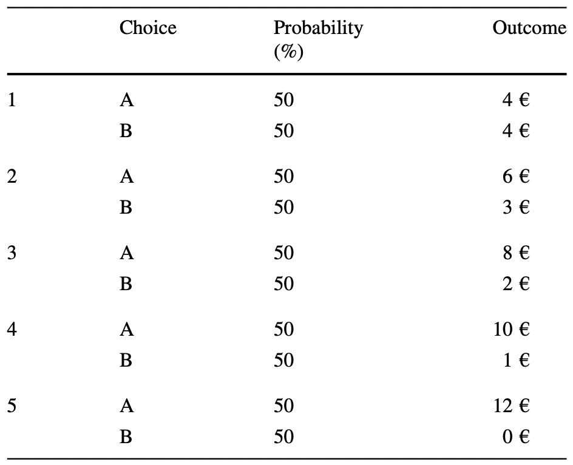
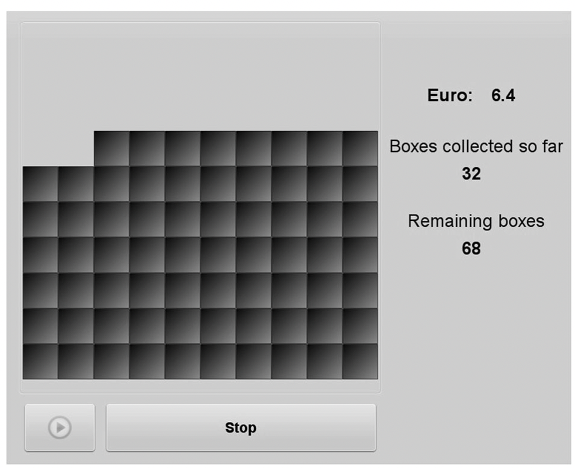
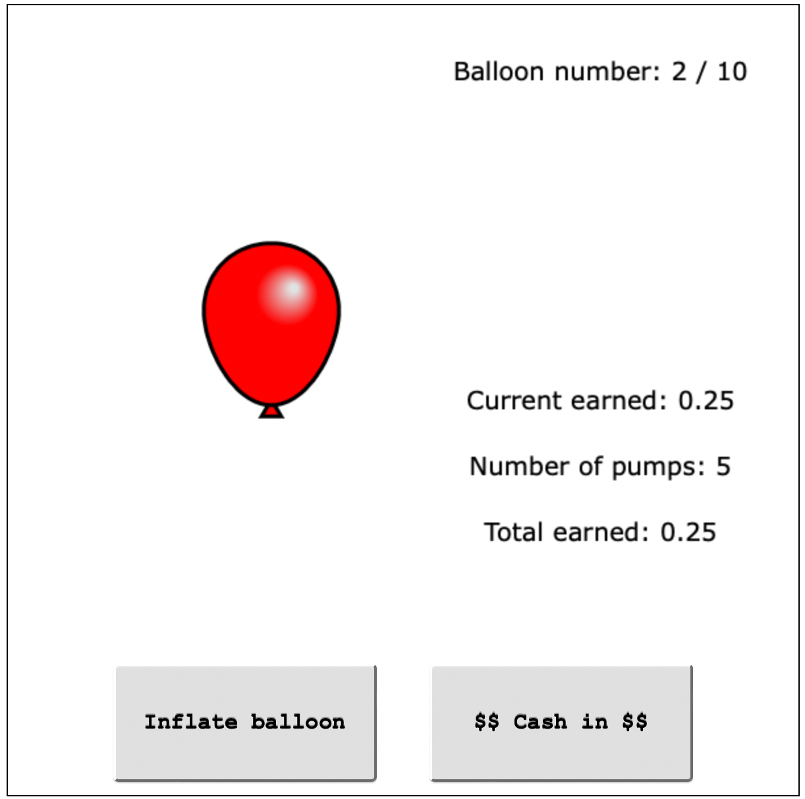

\newpage
\tableofcontents 
\newpage

```{r setup, message=FALSE, warning=FALSE, echo=FALSE, include=FALSE}
## packages for the project
source("libraries.R")
library(caret)
library(glmnet)
library(stargazer)


# import the bibfile
bibdf <- bib2df("METARET.bib")

## clean names
bibdf <- bibdf %>% 
  janitor::clean_names() %>% 
  rename(bibkey = bibtexkey)

## keep the authors, title, journal, year, DOI
bibs <- bibdf %>% select(bibkey, author, title, year, journal, doi_2)
df <- read.csv("df_mod.csv", sep = ",")
df <- merge(x=df, y=bibs, by="bibkey", all.x=TRUE) 

## Filter the variables we need for our study 
df_test = df %>% filter(task %in% c('HL', 'EG', 'BART', 'BRET', 'IG'), r <= 2.5) %>%
  select(bibkey, choice, task, doall, soep, r, gender, age, country) %>% drop_na() %>% rename(is_female = gender)

## Found an error in the data frame
df_test$task[df_test$task=="BART" & df_test$bibkey == "Crosetto2016"]<-"BRET"

##################################
## Add some characteristics ##
##################################

## 1. Check if task is visual. Normally it should help to make results better

df_test$is_visual = with(df_test,
                    ifelse(task == 'BRET' | task == 'BART', 1, 0))

## 2. Check if the list is a price list
df_test$is_price_list = with(df_test,
                        ifelse(task == 'BRET' | task == 'BART' | task == 'IG' , 0, 1))

## 3. Variable dimensions (Probabilities, Outcomes)
df_test$probabilities_change = with(df_test,
                            ifelse(task == 'BRET' | task == 'BART' | task == 'HL', 1, 0))

## 4. Number of choices 

#df_test$n_choices = with(df_test,
#           ifelse(task == 'BRET' & bibkey == "Crosetto2013", 100, 
#                  ifelse(task == 'BRET' & bibkey == "Crosetto2016", 100, 
#                         ifelse(task == 'EG' & bibkey == "Crosetto2016", #5,
#                                ifelse(task == 'HL' & bibkey == #"Crosetto2016", 10,
#                                       ifelse(task == 'IG' & bibkey == "Crosetto2016", 40,
#                                              ifelse(task == 'BART' & bibkey == "Frey2017", 128,
#                                                     ifelse(task == 'HL' & bibkey == "Frey2017", 10, 0))))))))


## 5. Neutral to risk payments

df_test$stakes = with(df_test,
                         ## 
             ifelse(task == 'BRET' & bibkey == "Crosetto2013", 0.1 * 100/2 * 0.5, 
                    
                    ifelse(task == 'BRET' & bibkey == "Crosetto2016", 0.2 * 100/2 * 0.5, 
                           
                          ### Lottery 5 is chosen
                           ifelse(task == 'EG' & bibkey == "Crosetto2016", 0.5 * 12,
                                  
                                  ## lottery 5 is the switching point
                                  ifelse(task == 'HL' & bibkey == "Crosetto2016", 4.86,
                                         
                                         ## 2.5 times 4
                                         ifelse(task == 'IG' & bibkey == "Crosetto2016", 4 * 2.5 * 0.5,
                                                
                                                ## Frey 0.005 for each pump, Risk neutral = 64 pumps for 10 ballons
                                                ifelse(task == 'BART' & bibkey == "Frey2017", 128 / 2 * 0.005 * 10 * 0.5,
                                                     
                                                        ## €0.05 for each point , Risk neutral = 5 choice
                                                       ifelse(task == 'HL' & bibkey == "Frey2017", 5.82, 0))))))))


## 8. Country
## there are 2 countries... 
df_test$germany = with(df_test,
                    ifelse(country == 'Germany', 1, 0))
```

<!-- 

Salut Liza, je décris ce que je vais faire sur ce fichier. 

1. si le changmenet est juste de français ou de forme, je le fais directement. TU peux le voir avec un diff entre ce fichier et le tien. (il y a plein de logiicel pour voir un diff, je te laisse faire, si t'as besoin, dis-moi. 

2. Si le changement est plus important, je laisse un commentaire comme celui-ci (il ne s'affiche pas sur le pdf). 

3. Pour les commentaires, pareil, ce sera des commentaires sur ce .Rmd comme celui-ci. 

Allez on attaque

-->

# Introduction

Ce rapport est consacré à l'analyse du déroulement de stage dans le cadre de la formation en Master 1, parcours Business et Analyse de Données, Faculté d’Économie de l'Université Grenoble Alpes. La première partie de ce rapport décrira le processus de recherche de mon stage, l'évolution de mon CV et de ma lettre de motivation, et comment ma candidature s’était diffusée à diverses organisations. La deuxième partie du rapport parlera de l'organisation où j'ai effectué mon stage, notamment ses principales activités, le nombre d'employés. La troisième partie est réservée à la description du projet auquel j'ai participé, c'est-à-dire son objectif global et mon rôle dans sa réalisation. Dans la quatrième partie, une de mes missions sera décrite en détail. Dans la cinquième partie finale, les résultats de mon stage seront résumés.

\section{Recherche de stage et présentation de la structure}
\label{sec:first}

\subsection{Recherche de stage}

Dans cette section, je décrirai comment mon CV et ma lettre de motivation ont évolué en fonction de l'expérience de recherche d'un stage. Au départ, j'ai rédigé un CV qui ne contenait que des faits nus sur ma formation, mon expérience de travail et mes compétences. Par exemple, je n'ai pas décrit mes tâches dans mes emplois antérieurs, ni précisé les matières que j'ai suivies pendant mes études. Au fil du temps, je me suis rendu compte que ces détails sont importants pour se démarquer des autres candidats. J'ai réfléchi plus attentivement à mes avantages, listé mes réalisations au travail, les sujets que j'ai étudiés. J'ai également ajouté à mon CV mes qualités personnelles que les recruteurs recherchaient pour le poste d'analyste de données.

J'ai aussi initialement rédigé une lettre de motivation individuellement pour chaque poste, en précisant le nom de l'entreprise, le nom du recruteur, pour que la lettre ait l'air personnelle. Cependant, cela a pris beaucoup de temps et n'a donné aucun résultat. Comme le processus de candidature en France est bureaucratiquement compliqué, avec le temps, j'ai décidé de simplifier ma lettre de motivation et de la rendre universelle. 

Je tiens également à souligner la participation de l'université aux modifications qui ont eu lieu. Avec l'aide de Sylvian Houset, les fautes de frappe et les formulations inexactes ont été corrigées dans mon CV et ma lettre de motivation.

Après avoir modifié mon CV et ma lettre de motivation, j'ai commencé à recevoir des offres d'emploi, mais elles ne me convenaient pas pour poursuivre le processus de formation. J'ai eu plusieurs entretiens et noté les entreprises où je pourrais essayer d'obtenir un emploi après la fin de ma formation. En parallèle, j'ai diffusé activement mon CV aux entreprises de Grenoble et ses environs, y compris les offres envoyées par les responsables de notre master, et je me suis renseignée également sur les postes disponibles parmi les professeurs de mon université. Au total, j'ai postulé à plus de 70 endroits pour toute la recherche. Finalement, j'ai trouvé un stage dans le laboratoire GAEL avec Paolo Crosetto qui a été chargé du cours d'analyse de données en R que j'ai suivi. Ayant déjà 4 ans d'expérience dans le domaine scientifique en Russie et cherchant la possibilité de poursuivre mon activité à l'international, j'étais convaincue que ce stage s'intègre parfaitement dans mon projet professionnel. 

\subsection{Présentation de la structure de stage}

L'organisme qui m'a accueilli est l’Institut National de Recherche pour l’Agriculture, l’alimentation et l’Environnement (INRAE). J'ai effectué un stage dans un des laboratoires affiliés à cet organisme, à savoir au Laboratoire d'Economie Appliquée à Grenoble (GAEL). Il est composé d'une quarantaine de chercheurs auxquels s'ajoutent des post-doctorants, des doctorants et du personnel administratif et d'appui à la recherche. 

\section{Missions effectuées pendant le stage}
\label{sec:third}

On peut observer que les gens, lorsqu'ils sont exposés à l'incertitude, agissent différemment. La plupart essaient de minimiser cette incertitude autant que possible. Par exemple, un investisseur peut choisir d'investir son argent dans un compte bancaire avec un taux d'intérêt faible mais garanti, plutôt que dans des actions, qui peuvent avoir un rendement attendu élevé mais également comporter un risque de perte. Cet effet est appelé aversion au risque, il caractérise la propension des personnes à prendre telle ou telle décision face au risque. L'analyse de l'aversion au risque joue un rôle primordial dans plein de domaines de l'économie et de la vie. 

Une des direction dans l'économie expérimentale est d'éliciter les risques, c'est-à-dire de formaliser le comportement des personnes en situation à risque. Un concept qui décrit la capacité d'une mesure d'en prédire des autres, ou de prédire des comportements est connu comme validité externe. Il existe différentes techniques pour mesurer les attitudes face au risque. Une question directe peut être posée pour le déterminer, par exemple, « Comment vous voyez-vous ? Êtes-vous généralement une personne totalement prête à prendre des risques ou essayez-vous d'éviter de prendre des risques ? » (@SOEP2007) ou il peut être la demande d'indiquer la probabilité d'être impliqué dans un événement particulier, comme tricher à un examen (@Blais2006). De même il est possible d'estimer les attitudes face au risque en utilisant une tâche d'élicitation des risques (RET, *Risk Elicitation Task*), par exemple, où le répondant est invité à choisir entre deux options plus et moins risquées (@Holt2002) ou à choisir une seule loterie de la liste proposé (@Eckel2002). Il existe de nombreuses variantes de ces tâches, certaines impliquent une composante visuelle pour une perception plus facile (@Lejuez2002, @Crosetto2013). Dans quelques tâches, les pertes sont implicites (@Menkhoff_Sakha_2017), dans d'autres les loteries se trouvent entièrement dans le domaine des gains (@Eckel2002, @Holt2002). Dans certaines tâches, il y a le choix entre deux loteries, dont l'une est plus risquée. D'autres peuvent offrir un choix entre loterie risquée et un somme d'argent, techniquement connu comme un *équivalent certain* (@Menkhoff_Sakha_2017, @Csermely2014). 

<!-- Attention: il n'y a **rien** d'irrationnel dans l'aversion au risque. 

Des préférences en éconmie se disent rationnelles si elles satisfont 3 axiomes (completeness, transitivity, local non-satiation), et parfois un 4ème (indipendence irrelevant alternatives). On peut très bien être averse au risque et être rationnel -- i.e. avoir des préférences rationnelles et les maximiser. 

L'aversion au risque est une caractérisque d'un individu, ni plus ni moins; puis si l'indivdu maximise son bien être ou pas, ça on sait pas et n'est pas gagné d'avance, mais il ne suffit pas de dire "oh, risk averse, then irrational". Just not true. 

Donc il faudrait changer un peu ce paragraphe; on s'intéresse à l'aversion au risque parce qu'elle joue un rôle primordial dans plein de domaines de l'économie et de la vie, mais pas parce que les gens sont "irrationnels". Ce qui relève de l'éco behavioral et (si on veut) de l'irrationalité est plutôt l'aversion **aux pertes**, mais ce n'est pas le thème de notre stage / projet. -->

La thème du projet où j'ai participé pendant mon stage était "Méta-analyse de la validité externe des tâches d'élicitation des risques". Il vise à rassembler les connaissances existantes dans la domaine de l'elicitation des risques, de mieux comprendre l'état actuel de la validité externe des mesures qui aident d'identifier des risques (par méta-analyse) et donner libre accès à d'autres chercheurs et personnes intéressées en ligne et avec une base de données en constante augmentation.  

<!-- Peut-être avant ce paragraphe sur l'élicitation il faudrait dire qu'est-ce que c'est qu'une "élicitation", comment on mesure les attitudes face au risque, et qu'est-ce que c'est que la "validité externe". Sinon, ce n'est pas très clair pour quelqu'un qui n'en saait rien. -->

L'enjeu principal de ce projet est de repenser les tâches d'élicitation des attitudes face au risque. Le fait est que les RETs montrent la validité externe basse avec les mesures autodéclarées et avec celles issues d'activités à risque dans le monde réel et entre eux. <!-- , un concept qui décrit la capacité d'une mesure d'en prédire des autres, ou de prédire des comportements; ce concept en économie expérimentale est plutôt connu comme *validité externe*. --> Ainsi, le résultat de l'analyse des données recueillies au cours du projet devrait être la création d'une nouvelle tâche qui résoudrait le problème de la faible corrélation.

Il est à noter, que le projet pré-existait à mon stage, il a été lancé en 2019 sous la direction de Paolo Crosetto. Au début de mon stage, une version brute du site web avec la base de données pas très grand et une série limitée de fonctionnalités était prête, mais elle devait être entièrement repensée. En outre, lors de la création d'un nouveau site web, j'ai pris quelques idées conceptuelles de la version originale. 

Ma mission principale était de redévelopper un site web informatif, bien structuré, techniquement stable et joli en utilisant `R shiny`. Pour y parvenir, j'ai dû effectuer plusieurs sous-tâches. Tout d'abord, j'ai lu nombreux articles scientifiques différents basés sur des expériences en laboratoire. Deuxièmement, une demande de données a été faite pour enrichir le site auprès de la communauté scientifique en suivant deux méthodes : 

\begin{enumerate}
\item Paolo a envoyé un e-mail décrivant le projet et demandant l'accès aux données issues d'expériences d'élicitation des attitudes face au risque en laboratoire à ses collègues directement, en utilisant la base de contact qu'il avait et la liste de diffusion `ESA-discuss`. Une quinzaine d'auteurs ont partagé ces informations avec nous. Depuis lors, de nouvelles données ainsi que les fonctionnalités ont été ajoutées au site, Paolo renverra encore une demande afin d'obtenir plus de données; 
\item Étant donné que peu de personnes ont répondu, nous avons décidé d'élargir notre base de contacts et de rechercher d'autres auteurs qui ont fait des expériences similaires. Nous avons convenu de chercher des articles pour chaque type de tâche que nous considérons dans notre projet et pour lequel nous n'avons pas eu beaucoup d'observations.

En utilisant les mots clés appropriées dans Google Scholar, j'ai sélectionné une liste d'articles qui contiennent très probablement des données sur les expériences. Vérifier manuellement le contenu de tous les articles et extraire les e-mails des auteurs prendrait beaucoup de temps, j'ai donc écrit un analyseur en Python qui le faisait automatiquement.

Ainsi, les liens sur ces articles et son information donnée par le site, tel que les noms d'auteurs et d'article et l'année de publication ont été collectés pour chaque type de tâche. Ensuite, j'ai supprimé les articles pour lesquels nous avons déjà des données.

Puis, j'ai commencé à suivre les liens et à essayer de lire le texte des articles. Cependant, avec l'aide de Google Scholar, il n’était pas possible y accéder qu'à une partie gratuitement. La plupart était toujours disponible uniquement par abonnement. C’est pourquoi j'ai utilisé le site Scihub, qui fournit un accès automatique et gratuit aux textes des articles scientifiques. J'ai écrit le deuxième analyser pour lire le reste des articles avec Scihub et extraire des mails à partir du format pdf en Python. Après avoir analysé environ 1500 articles, j'ai pu extraire les e-mails d'environ 600. 

Paolo va bientôt rédiger les messages personnels afin de diffuser une demande à chaque auteur pour les données des expériences menées dans leurs articles.

\end{enumerate}

Ensuite, il fallait alimenter le site web avec une quantité importante de base de données d'élicitation de risque qu'on a reçu dans une manière unifiée et uniformisée pour toutes les expériences. Principalement, ce travail se réduit aux calculs nécessaires pour obtenir le paramètre d'aversion relative constante du risque (CRRA)[^1] pour chaque article en utilisant la méthodologie <!--en français "spécial" veut dire "bizarre"; c'est mieux donc de rien mettre ou de mettre "particulier". "Un méthodologie spéciale" veut dire "une méthodologie bizarre"; il faut dire "une méthodo particulière"; dans ce cas c'est OK de ne pas mettre d'adjectif du tout. --> qui sera précisé dans la partie 4.3. Il était également nécessaire d'identifier sans ambiguïté d'autres variables, telles que le genre, l'age, le pays dans lequel l'expérience a été menée, la ville, etc.    

[^1]: https://en.wikipedia.org/wiki/Risk_aversion

Finalement, en utilisant cette base des données, le site web a été recréé avec l'ajout de nouvelles fonctionnalités en utilisant le package `Shiny`. Le développement du site comprenait la conception de la structure du site, ainsi que son contenu. Par exemple, construire des distributions pour le paramètre CRRA pour chaque élément ou chaque type de question, calculer également des corrélations, créer de cartes géographiques, ainsi que des tableaux avec des sources de données, etc. 

J'ai également essayé de contribuer à résoudre le problème de la faible validité externe entre RETs et les questionnaires sur la base des données collectées. L'approche pour cette mission est décrite dans la partie 4 de ce rapport.

\section{Développement d’une mission avec problématique économique et analyse}
\label{sec:fourth}

\subsection{Problématique économique}

Des tentatives pour faire une méta-analyse des résultats de diverses expérimentations contenant de tâches d'élicilation du risque ont déjà été faites dans la littérature en économie expérimentale (@CroFil2013b, @Alserda2019, @Bokern2021). Cependant, une analyse détaillée des caractéristiques des tâches, ainsi que des questions supplémentaires aux répondants sur un large échantillon de données, n'ont pas été réalisées auparavant. La problématique économique qui décrit une de mes missions est une recherche des caractéristiques de la tâche d'élicitation du risque qui expliqueraient au mieux l'attitude réelle face au risque. 

Ainsi, dans ce rapport je essaye de résoudre le problème de la faible corrélation entre RETs et les questionnaires. Pour ce faire, je cherche tels caractéristiques des RETs qui contribuent à l'améliorer. Pour répondre à cet problématique j'utilise des données du projet METARET que j'ai contribué à moderniser, améliorer et remplir et je présente ma méthodologie empirique décrite dans la sous-section 4.6.
 
\subsection{Base de données}

Actuellement, la base de données du site web contient les résultats d'expériences de 85 articles, mobilisant 9 tâches différentes pour éliciter des attitudes à l'égard du risque, ainsi que 6 types de questionnaires. Au total, `r n_distinct(df$subject)` personnes ont participé à ces études. Il convient de noter que les variables recueillies auprès des participants peuvent être différentes d'une étude à l'autre. Par exemple, certains auteurs n'ont pas collecté d'informations sur l'âge des répondants. Donc, pour la présente étude, une partie des données contenant les informations les plus complètes sur les expériences a été sélectionnée. Elle comprenait des données provenant de trois expériences de laboratoire (@Crosetto2013, @Crosetto2016, @Frey2017), totalisant `r nrow(df_test)` observations. Ces données contiennent des informations sur les réponses à 5 tâches différentes d'identification des risques, ainsi que des réponses à 2 types de questionnaires. Pour chaque participant, son choix dans la RET et dans les questionnaires, son sexe et son âge, ainsi que le pays de l'expérience sont connus. Pour mener cette étude, 5 types de tâches ont été sélectionnés, à savoir Holt and Laury task (par la suite, HL), Eckel and Grossman task (EG), Investment game (IG), Balloon Analog Risk Task (BART) et The Bomb Risk Elicitation Task (BRET). Des informations détaillées sur les tâches considérées sont fournies dans la sous-section "*Types de tâches d'élicitation du risque*". Le tableau 1 ci-dessous fournit des statistiques descriptives pour cette base de données. 

Tableau 1 - Statistiques descriptives de la base de données.

| Variables                    |                    | n    |
|------------------------------|--------------------|------|
| Genre                        | Femme              | `r df_test %>% filter(is_female == 1) %>% count()` |
|                              | Homme              | `r df_test %>% filter(is_female == 0) %>% count()` |
| Age                          | 18-25              | `r df_test %>% filter(age >= 18, age <=25) %>% count()`  |
|                              | 26-35              | `r df_test %>% filter(age >= 26, age <=35) %>% count()`  |
|                              | 36-44              | `r df_test %>% filter(age >= 36, age <=44) %>% count()`    |
|                              | 45-54              | `r df_test %>% filter(age >= 45, age <=54) %>% count()`    |
|                              | plus que 55        | `r df_test %>% filter(age >= 55) %>% count()`    |
| Attitude à l\'égard du risque | Réticent au risque | `r df_test %>% filter(r < 1) %>% count()` |
|                              | Risque neutre      | `r df_test %>% filter(r == 1) %>% count()`  |
|                              | Preneur de risques | `r df_test %>% filter(r > 1) %>% count()`  |
| Types de tâches              | HL                 | `r df_test %>% filter(task == 'HL') %>% count()` |
|                              | IG                 | `r df_test %>% filter(task == 'IG') %>% count()`   |
|                              | EG                 | `r df_test %>% filter(task == 'EG') %>% count()`   |
|                              | BRET               | `r df_test %>% filter(task == 'BRET') %>% count()` |
|                              | BART               | `r df_test %>% filter(task == 'BART') %>% count()` |
| Pays                         | Germany            | `r df_test %>% filter(country == 'Germany') %>% count()` |
|                              | Switzerland        | `r df_test %>% filter(country != 'Germany') %>% count()` | 

Je tiens d'ajouter quelques mots de la modification de la base de données initiale. Avant mon stage, elle était composée d'environ 55 articles contenant 6 types de RET et 2 types de questionnaires. 
J'ai donc nettoyé et ajouté à la base les données de 30 articles. <!-- faut bien souligner ta contribution, pas laisser le lecteur faire des calculs pour la retrovuer! :-) -->
Elle contenait des données telles que le choix du répondant à la loterie et/ou dans le questionnaire SOEP et/ou DOSPERT, son sexe, son âge, s'ils étaient indiqués dans l'article. Pendant le stage, des informations sur le pays de l'expérience ont été ajoutées pour chacune des 85 articles. En travaillant sur la base, j'ai aussi compilé d'autres variables, décrites dans la section "Variables pour l'étude".

\subsection{Types des tâches d'élicitation du risque}

Examinons de plus près les types des tâches choisis pour cette étude. L'une des RET les plus populaires est *Multiple price list* de Holt and Laury (HL, @Holt2002). Les sujets sont confrontés à une série de choix entre des paires de loteries, l'option A étant plus sûre que l'option B (Tableau 2). Les paires de loterie sont classées par valeur attendue croissante. Les sujets font un choix pour chaque paire de loteries et doivent à un moment donné passer à l'option risquée. Le point où le sujet bascule sur l'option risquée capte l'aversion au risque du sujet. Un sujet neutre au risque devrait commencer par l'option A et passer à B à partir du cinquième choix. À la fin de l'expérience, une ligne est choisie au hasard pour le paiement, et la loterie choisie est jouée pour déterminer le gain. Il convient de noter que si le répondant passe de la loterie A à la loterie B, puis vice versa, ces cas sont supprimés de la base de données, car le répondant est considéré comme incohérent -- sa réponse n'est pas rationnalisable.

Tableau 2 - La liste de prix multiple de Holt and Laury  

\hfil { height=30% width=60% } \hfil

Source : @Holt2002

Une autre tâche assez connue est la *Ordered lottery selection* de Eckel and Grossman (EG, @Eckel2002). Les sujets choisissent une loterie parmi un ensemble de 5 loteries caractérisées par une valeur attendue croissante linéairement ainsi qu'un écart type plus grand, avec la probabilité de chaque option étant fixée à 50 % (Tableau 3). Un participant neutre au risque devrait choisir la loterie 5, car elle donne la valeur attendue la plus élevée. 

Tableau 3 - La sélection de loteries triées de Eckel and Grossman

\hfil { height=30% width=60% } \hfil

Source : @Eckel2002

Le prochain type de tâche s'appelle *The investment game* (IG, @Gneezy1997). Les sujets doivent décider comment répartir une montant disponible entre une option sûre et un investissement risqué qui donnerait plusieurs fois le montant investi ou zéro avec une probabilité égale. Dans ce cas, un sujet neutre au risque devrait investir toute sa dotation.

La RET suivant est *The Bomb Risk Elicitation task* (BRET). C'est une tâche d'identification visuelle des risques en temps réel présentée par @CroFil2013b. Les sujets se voient proposer un champ avec des boîtes mesurant 10 × 10. Ils sont informés que 99 boîtes sont vides et une seule contient une bombe programmée pour exploser. Pour chaque boîte ouverte, le répondant reçoit de l'argent. Sous le champ se trouvent les boutons "Démarrer" et "Arrêter". A partir du moment où le sujet appuie sur "Démarrer", une boîte est automatiquement collecté chaque seconde, en commençant par le coin supérieur gauche du carré. Mais si une boîte avec une bombe a été ouverte, il ne devient connu qu'après avoir appuyé sur le bouton d'arrêt. Alors, tous les gains potentiels sont effacées et le sujet ne gagne rien.

{ height=30% width=60% }

Source : @CroFil2013b

Une tâche similaire à BRET est *The Balloon Analogue Risk Task* (BART, @Lejuez2002). Dans cette tâche, le participant se voit présenter un ballon et se voit offrir la possibilité de gagner de l'argent en gonflant le ballon en cliquant sur un bouton. Chaque clic provoque le gonflement progressif du ballon et l'ajout d'argent à un compteur jusqu'à un certain seuil, à partir duquel le ballon est surgonflé et explose. Les participants ne sont pas informés des points d'explosions aléatoires des ballons. Ainsi, chaque pompe confère un plus grand risque, mais aussi une plus grande récompense potentielle. Si le participant choisit d'encaisser avant que le ballon n'explose, il récupère l'argent gagné pour ce jeu, mais si le ballon explose, les gains pour cet essai sont perdus. 

Tous les types de RETs decrit ci-dessus aident à classifier les répondants en fonction de leur attitude à l'égard du risque. Dans le cadre du projet, on a supposé que les participants ont la même fonction CRRA de préférence pour le risque \(u(x) = x^r\). Ainsi, l'attitude face au risque peut être résumée par le coefficient d'aversion relative au risque *r*. Considérons la tâche proposée par @Holt2002. Pour chaque moment de changement des préférences de la loterie A à la loterie B, il est possible de déterminer l'intervalle où tombe la valeur de ce paramètre.

Par exemple, si le répondant a choisi sur la quatrième ligne la loterie B, alors la solution de l'équation \(0.4*4^r + 0.6*3.2^r = 0.4*7.7^r + 0.6*0.2^r\) sera le seuil supérieur de l'intervalle et la solution de \(0.3*4^r + 0.7*3.2^r = 0.3*7.7^r + 0.7*0.2^r\) sera le seuil inférieur. 

{ height=40% width=60% }

Source : https://timo.gnambs.at/research/bart

Pour tenir compte d'une éventuelle erreur de mesure, lors de la mise à jour du site, pour ce répondant une des valeurs de CRRA distribué uniformément est implémentée avec une valeur minimale de 0.32 et une valeur maximale de 0.59 (les solutions aux équations presentées ci-dessus). Comme ça les valeurs appropriées ont été calculées pour tous les participants de ce type de tâche. Dans le point de commutation sur la toute première loterie, seul le seuil inférieur est utilisé, et dans le cas de la dixième - seul le seuil supérieur. Les répondants ayant choisi la loterie sûre tout le temps cont exclus, parce qu'ils préfèrent strictement moins d'argent avec probabilité 1, et ceci n'est pas rationnalisable.

De manière similaire il est possible de calculer le parametre *r* pour *Ordered lottery selection* de Eckel and Grossman. Pour chaque loterie sélectionnée, les seuils supérieur et inférieur de l'intervalle sont calculés. Par exemple, si la loterie 3 est sélectionné, alors le seuil supérieur sera la solution de l'équation suivante: \(8^r + 2^r = 10^r + 1^r\). 

Considérons un exemple pour montrer comment calculer le `r` pour *Investment Game* RET. Soit la montant disponible est de $50$, et lors de l'investissement, le montant peut augmenter de $3.5$ fois avec une probabilité de $50$%, alors:  \((50 - x)^r + 0.5 * (3 * x)^r\). Pour obtenir équation dépendant du choix d'un répondant, il faut maximiser cette fonction et puis la résoudre par rapport à l'appétit pour le risque (`r`). Après il faut mettre le `x` investie dans l'expression résultante pour chaque répondant afin d'obtenir son CRRA. 

La formulation des tâches BRET et BART permet de mesurer l'attitude face au risque du répondant sans recourir à des formules complexes. Ainsi, dans le cas du BRET il suffit de compter le nombre de boîtes ouvertes et de les diviser par le nombre de celles restantes. Ainsi, un répondant neutre au risque ouvrira 50 boîtes de 100.

\subsection{Questionnaires}

Dans cette étude, deux types de questionnaires ont été considérés. Le premier type est une question sur la volonté de prendre des risques du questionnaire SOEP (German SOcio-Economic Panel, @SOEP2007) et notamment « *Comment vous voyez-vous ? Êtes-vous généralement une personne totalement prête à prendre des risques ou essayez-vous d'éviter de prendre des risques ? *» La question est répondue sur une échelle Likert[^2] de 0 à 10. 

[^2]: Echelles numériques mais dans lesquelles on ne sait pas si la distance entre 1 et 2 est égale à celle entre 6 et 7 (par exemple) dans la tête des sujets, s'appellent une échelle Likert.

Le deuxième type est le questionnaire DOSPERT. C'est une échelle psychométrique qui évalue la prise de risque dans cinq domaines : décisions financières (décomposé ensuite en jeux d'argent et investissement), santé/sécurité, décisions récréatives, éthiques et sociales, à l'aide de 40 questions au total. Les répondants évaluent la probabilité qu'ils s'engagent dans des activités à risque spécifiques à leur domaine en utilisant échelle de 1 à 7. Les réponses à ces questions sont ensuite pondérées par chaque domaine et additionnées pour former une seule série agrégée.
Pour générer une version courte de l'échelle avec des questions qui seraient interprétables par un plus large éventail de répondants dans différentes cultures, les 40 items de l'échelle originale (@Weber2002) ont été réduits à 30 items (@Blais2006), ce qui a été utilisé dans le rapport actuel. 

\subsection{Variables pour l'étude}

<!-- Je mets ce commentaire ici, mais je pourrais le mettre ailleurs. Il me paraît que tu ne dises pas assez clairement QUEL EST le but ultime de ton exercice empirique. Ce que tu veux faire, c'est d'essayer de resoudre le problème de la faible corrélation RET/quest; pour ce faire, tu te demandes quelles caractéristiques des RETs font si qu'il y ait une meilleure corrélation RET/quest; et tu réponds à cette question en utilisant des données du projet Metaret que tu as contribué à moderniser / améliorer / remplir et avec ta méthodologie empirique décrite plus bas. Il faudrait mettre ça de façon très centrale et claire quelque part, AVANT de plonger dans les détails. 

Plus en gros, un article scientifique doit être écrit de la façon suivante
1. QUESTION à répondre
2. pourquoi on veut y répondre
3 comment on va y répondre
4. réponse 
5. limites de la réponse

Ici tu dois ajouter une partie de cette liste aprce que tu dois parler du stage, de ton travail sur le site etc... mais bon, une fois ces choses faites, il FAUT suivre ce schéma le plus possible, et en particulier mettre BIEN EN CLAIR quelle est la QUESTiOn qui guide ton rapport / ton travail. 
-->

Il a été mentionné ci-dessus que la base de données contient des données sur les répondants, à savoir le sexe, l'âge et le pays de participation à l'expérience. Pour répondre au problème posé, il est nécessaire de mettre en évidence certaines variables qui permettront de décrire les tâches. Et donc, 8 nouvelles variables ont été notées pour chaque RET et implementation du RET : `is_visual`, `is_price_list`, `probabilities_change`, `stakes` et variables dummy pour chaque type de tâche - BRET, BART, EG, IG, où HL est la référence. Les données pour toutes les variables ont été tirées des articles respectifs. La variable `stakes` conçue comme le montant espéré qu'un sujet neutre au risque pourrait s'attendre de gagner de la tâche. Elle a été calculée manuellement de la manière suivante. La stratégie du répondant neutre au risque lorsqu'il répond à la tâche BRET est d'arrêter le jeu à exactement la moitié des boîtes ouvertes. Étant donné que l'emplacement de la bombe n'est révélé qu'après avoir appuyé sur le bouton "Arrêter", la probabilité de ne pas rencontrer la bombe est de $0.5$. Pour l'ouverture de chaque boîte, une récompense en espèces est donnée. Dans l'article de @Crosetto2013, il était de $0.1$ euro et dans l'article de @Crosetto2016, il était de $0.2$ euro. La formule de calcul du gain neutre au risque est donc \(0.1 * 100 / 2 * 0.5\) et \(0.2 * 100 / 2 * 0.5\) respectivement pour chaque article. De même, dans la tâche BART, le neutre au risque choisirait également la stratégie du demi-maximum. Pour chaque gonflage du ballon, $0.005$ euros sont versés. Au total, il est proposé de gonfler $10$ ballons. Ainsi, pour le jeu, neutre au risque reçoit une récompense $128 / 2 * 0.005 * 10 * 0.5$. Dans la tâche EG (@Crosetto2016) un sujet neutre au risque choisira la loterie avec le gain le plus élevé, c'est-à-dire la dernière ligne. Ainsi, son gain ésperé sera de $12 * 0.5$. Dans la tâche HL, le répondant neutre au risque passera à l'option risqué à partir de la cinquième ligne. Selon les règles, une seule loterie sur dix sera joué à la fin de la partie. Trouvons tous les gains attendus pour chaque loterie en s'appuyant sur le tableau 2 (tableau 4). Dans la colonne de droite, les loteries qui ont été choisies par le répondant neutre au risque ont listé. Résumons les gains. L'occurrence de chacun des 10 évènements est également probable, on peut donc diviser la valeur résultante par 10 pour trouver l'espérance mathématique moyenne de gagner. 
\newpage
Tableau 4 - Les calculs des gains attendus

|       | Espérance de loterie A | Espérance de loterie B | Options choisi  |
|-------|--------------------------|--------------------------|-----------------|
| 1     | 3.28                     | 0.95                     | 3.28            |
| 2     | 3.36                     | 1.7                      | 3.36            |
| 3     | 3.44                     | 2.45                     | 3.44            |
| 4     | 3.52                     | 3.2                      | 3.52            |
| 5     | 3.6                      | 3.95                     | 3.95            |
| 6     | 3.68                     | 4.7                      | 4.7             |
| 7     | 3.76                     | 5.45                     | 5.45            |
| 8     | 3.84                     | 6.2                      | 6.2             |
| 9     | 3.92                     | 6.95                     | 6.95            |
| 10    | 4                        | 7.7                      | 7.7       
| Total |                          |                          | 48.55           |
Ainsi, la valeur d'espérance pour la tâche HL pour l'article @Crosetto2016 est de $4.86$. Une procédure similaire a été effectuée pour l'article de @Frey2017, la valeur de gain résultante est de $5.82$.
Lors de la participation à la tâche IG, la personne neutre au risque doit investir la totalité de son montant disponible. Donc, pour l'article de @Crosetto2016, `stakes` prend la valeur $4 * 2.5 * 0.5$. 

Ci-dessous il y a un tableau de toutes les variables explicatives pour cette étude. 

Tableau 5 - Les variables explicatives

| Nom de variable      | Commentaire                                           | Valeurs de variable        |
|----------------------|-------------------------------------------------------|----------------------------|
| age                  | Age de répondant                                      | variable continue          |
| is_femme                | Genre de répondant                                    | 1 - Femme                  |
|                      |                                                       | 0 - Homme                  |
| germany                     | Si le pays d'expérimentation est l'Allemagne | 1 - Germany                |
|                             |                                              | 0 - Switzerland            |
| is_visual            | La tâche a-t-elle un aspect visuel ?                  | 1 - BART ou BRET           |
|                      |                                                       | 0 - les autres RETs        |
| is_price_list        | La tâche contient-elle une liste de loteries ?        | 1 - HL ou EG               |
|                      |                                                       | 0 - les autres RETs        |
| probabilities_change | La tâche implique-t-elle des probabilités variables ? | 1 - HL, BART ou BRET       |
|                      |                                                       | 0 - les autres RETs        |
| stakes               | Rémunération de la neutralité au risque               | 2.5 - BRET, @Crosetto2013  |
|                             |                                              | 5 - BRET, @Crosetto2016    |
|                             |                                              | 1.6 - BART                |
|                             |                                              | 6 - EG                     |
|                             |                                              | 4.86 - HL, @Crosetto2016    |
|                             |                                              | 5.82 - HL, @Frey2017       |
|                             |                                              | 5 - IG                     |
| BRET | Type de loterie | 1 - BRET  |
|      |                 | 0 - HL  |
| BART   | Type de loterie | 1 - BART    |
|      |                 | 0 - HL  |
| EG   | Type de loterie | 1 - EG    |
|      |                 | 0 - HL  |
| IG   | Type de loterie | 1 - IG    |
|      |                 | 0 - HL  |

\subsection{Méthodologie}

Afin d'identifier les caractéristiques des tâches qui décrivent le mieux les attitudes face au risque, il est nécessaire de déterminer ce qui reflète réellement la perception du risque pour le répondant. En tant que reflet de la réalité, on peut considérer les réponses aux questions directes sur soi, c'est-à-dire SOEP et DOSPERT. Ainsi, le critère de qualité pour caractériser la tâche sera la distance entre le paramètre CRRA et les réponses aux questionnaires. 

La corrélation entre les réponses de questionnaires est de `r round(cor(df_test$doall, df_test$soep),2)`, il est donc logique de considérer deux modèles avec chaque questionnaire séparément. Pour comparer deux séries, il faut les mettre à des valeurs comparables. DOSPERT varie de 1 à 7 et le paramètre CRRA se situe quelque part entre -2 et 2.5. Il faut "tendre" les valeurs des paramètre R sur l'échelle de DOSPERT. J'ai fait la transformation suivant la formule $\frac{r - r_{min}}{r_{max} - r_{min}} * (t_{max} - t_{min}) + t_{min}$, où $r$ est le paramètre d'aversion au risque d'une CRRA, $r_{min}$, $r_{max}$ sont les valeurs du CRRA minimale et maximale; $t_{max}$, $t_{min}$ sont les valeurs de SOEP ou DOSPERT maximale et minimale. 

```{r distdospert, include=FALSE}
df_test$id = 1:nrow(df_test)

df_test$y_r_DospertScale = (df_test$r - min(df_test$r))/(max(df_test$r) - min(df_test$r)) * (7 - 1) + 1
df_test_dosp = df_test
df_test_dosp$y_r_DospertScale = df_test_dosp$y_r_DospertScale - .83352

df_test_dosp = df_test_dosp %>% filter( 
                   doall <= (1-(.83352)/6) * max(doall))

df_test_dosp %>% 
  select(y_r_DospertScale, doall, id, country) %>%
  pivot_longer(-c(id,country)) %>% 
  ggplot(aes(x = value, fill = name)) + geom_density(alpha = 0.3) + 
  geom_vline(xintercept = 4)+
  theme_minimal() + 
  theme(plot.title = element_text(hjust = 0.5))
```

```{r, include=FALSE}
df_test_dosp$y_gap_Dospert = abs(df_test_dosp$y_r_DospertScale - df_test_dosp$doall)

```
Si nous voulons minimiser la différence entre les séries, on a besoin que les points de neutralité du risque de deux distributions coïncident. Pour CRRA = 1, la valeur d'une nouvelle échelle de y (y_r_DospertScale) est égale à 4.83352. On sait aussi que le répondant neutre au risque obtient 4 sur l'échelle DOSPERT réelle. Soustrayons la valeur 0.83352 des valeurs de la série obtenu. Puisque nous avons soustrait la valeur, la partie de queue droite a été mise à zéro.  On peut tronquer la distribution sur la queue droite pour ne faire correspondre que les réponses réelles. Après une telle transformation, `r nrow(df_test_dosp)` observations sont restées dans l'échantillon. Maintenant on peut comparer ces deux distributions (Figure 3).

`)

```{r distsoep, include=FALSE}
## SOEP variable 

df_test$y_r_SoepScale = (df_test$r - min(df_test$r))/(max(df_test$r) - min(df_test$r)) * (10 - 0) + 0

df_test_soep = df_test
df_test_soep$y_r_SoepScale = df_test_soep$y_r_SoepScale - 2.542214
df_test_soep$id = 1:nrow(df_test_soep)

df_test_soep = df_test_soep %>% filter( 
  soep <= (1-(2.542214)/10) * max(soep))

df_test_soep %>% 
  select(y_r_SoepScale, soep, id, task) %>%
  pivot_longer(-c(id,task)) %>% 
  ggplot(aes(x = value, fill = name)) + geom_density(alpha = 0.3) + 
  geom_vline(xintercept = 5) +
  theme_minimal() + 
  theme(plot.title = element_text(hjust = 0.5))

```
```{r, include=FALSE}
df_test_soep$y_gap_Soep = abs(df_test_soep$y_r_SoepScale - df_test_soep$soep)
```

```{r, include=FALSE}
df_test$y_r_DospertScale = df_test$y_r_DospertScale - .83352

df_test = df_test %>% filter( 
                   doall <= (1-(.83352)/6) * max(doall))

df_test$y_gap_Dospert = abs(df_test$y_r_DospertScale - df_test$doall)


df_test$y_r_SoepScale = df_test$y_r_SoepScale - 2.542214

df_test = df_test %>% filter( 
  soep <= (1-(2.542214)/10) * max(soep))

df_test$y_gap_Soep = abs(df_test$y_r_SoepScale - df_test$soep)
```
J'ai répété la procédure avec mise à l'échelle et avec un décalage pour superposer les échelles. La neutralité au risque parmi les répondants de cet échantillon correspond à la valeur 7.542214. Pour répondre à SOEP, c'est le chiffre 5. Donc, j'ai soustrait la valeur de 2.542214 de la nouvelle échelle de y (y_r_SoepScale). De manière similaire à la procédure avec DOSPERT, on coupe une partie de la queue droite de la distribution de SOEP. Après une telle transformation, `r nrow(df_test_soep)` observations sont restées dans l'échantillon. Le graphique 4 montre ces deux distributions. 

`)

Couper la queue droite aide également à supprimer les valeurs aberrantes de la distribution. La limitation initiale du paramètre CRRA retenu pour l'étude, était conditionnelle, excluant le (peu) de sujets ayant une forte propension à prendre des risques. Il n'y avait aucune restriction sur les échelles DOSPERT et SOEP, bien que les répondants obtenant de 6 à 7 sur l'échelle DOSPERT et de 7 à 10 sur l'échelle SOEP soient des amateurs de risque Ainsi, pour la pureté de l'expérience, il est logique de filtrer les réponses également pour les deux questionnaires.

On dénote par la variable `y_gap_Dospert` la différence entre les séries CRRA avec une nouvelle échelle de 1 à 7 et DOSPERT, et par la variable `y_gap_Soep` la différence entre les séries CRRA avec une nouvelle échelle de 0 à 10 et SOEP. Prenons le valeur absolue des valeurs obtenues, puisque nous ne nous intéressons qu'à l'amplitude de l'écart, et non à la direction.

\subsection{Resultats}

```{r, include=FALSE} 
df_model =  df_test_dosp %>% 
  select(y_gap_Dospert, is_female, age, is_visual, is_price_list, probabilities_change, stakes, germany) %>%
  drop_na() 

simple.fit1 = lm(y_gap_Dospert~., data=df_model, )

df_model =  df_test %>% 
  select(y_gap_Dospert, is_female, age, is_visual, is_price_list, probabilities_change, stakes, germany) %>%
  drop_na() 

simple.fit2 = lm(y_gap_Dospert~., data=df_model, )

df_model =  df_test_soep %>% 
  select(y_gap_Soep, is_female, age, is_visual, is_price_list, probabilities_change, stakes,  germany) %>%
  drop_na() 

simple.fit3 = lm(y_gap_Soep~., data=df_model, )

df_model =  df_test %>% 
  select(y_gap_Soep, is_female, age, is_visual, is_price_list, probabilities_change, stakes, germany) %>%
  drop_na() 

simple.fit4 = lm(y_gap_Soep~., data=df_model, )

#----------------------------------------------------
df_test$BRET = with(df_test,
                    ifelse(task == 'BRET', 1, 0))

df_test$BART = with(df_test,
                    ifelse(task == 'BART', 1, 0))

df_test$HL = with(df_test,
                    ifelse(task == 'HL', 1, 0))

df_test$IG = with(df_test,
                    ifelse(task == 'IG', 1, 0))

df_test$EG = with(df_test,
                    ifelse(task == 'EG', 1, 0))
#----------------------------------------------------
## HL
df_model =  df_test %>% 
  select(y_gap_Soep, is_female, age, germany, BRET, BART, EG, IG) %>%
  drop_na() 

simple.fit6 = lm(y_gap_Soep~., data=df_model, )

## BRET
df_model =  df_test %>% 
  select(y_gap_Soep, is_female, age, germany, BART, HL, EG, IG) %>%
  drop_na() 

simple.fit7 = lm(y_gap_Soep~., data=df_model, )

#----------------------------------------------------
## HL
df_model =  df_test %>% 
  select(y_gap_Dospert, is_female, age, germany, BRET, BART, EG, IG) %>%
  drop_na() 
simple.fit9 = lm(y_gap_Dospert~., data=df_model, )

## BRET
df_model =  df_test %>% 
  select(y_gap_Dospert, is_female, age, germany, BART, HL, EG, IG) %>%
  drop_na() 
simple.fit10 = lm(y_gap_Dospert~., data=df_model, )

```

Donc, pour répondre à la problématique, et avec tout les variables que j'ai construit, je peux finalement faire une estimation avec un modèle de régression linéaire pour chaque type de questionnaire sur les certaines variables explicatives choisies pour l'analyse :

$y_i = c_i + beta_1 * is\_female_i+ beta_2 * age_i + beta_3 * is\_visual_i + beta_4 * is\_price\_list_i + beta_5 * probabilities\_change_i + beta_6 * stakes_i + beta_7 * germany_i + epsilon_i$ , où $y_i$ est $y\_gap\_Dospert_i$ et $y\_gap\_Soep_i$. 

Pour la comparabilité des résultats, un échantillon a été créé à partir duquel les valeurs aberrantes de SOEP et de DOSPERT ont été exclues. Il contenait `r nrow(df_test)` observations. On peut voir que le coefficient de détermination pour toutes les régressions est assez faible, et explique environ 10% de la variation pour l'écart entre CRRA et DOSPERT et environ 8% de la variation pour celui-ci entre CRRA et SOEP. 

Tableau 6 - Résultats de l'évaluation des régressions linéaires sur les caractéristiques des RETs et des répondants.  
```{r, include=FALSE}
star = stargazer(simple.fit2, 
          simple.fit4, 
          type = 'latex',
          no.space = TRUE, 
          header = FALSE, 
          table.layout = 'd-t-s-n', 
          font.size = "small",
          column.sep.width = "-5pt",
          omit.stat = c("f", "ser"))
star = sub('^.+\\caption.+$','', star)
```

```{r echo=FALSE, message=FALSE, warning=FALSE, results='asis'}
cat(star, sep='\n')
```

Selon les résultats obtenus, si le répondant est une femme, alors l'écart est plus faible pour les deux types de questionnaires. Egalement pour les tâches BRET, BART et HL, où les probabilités changent, la différence avec la réalité est moindre. L'écart est plus important lorsque la tâche est une liste des loteries (HL et EG) pour SOEP. Par rapport à la Suisse, l'Allemagne présente en moyenne un écart plus important pour DOSPERT. On peut également conclure que l'âge n'affecte pas l'importance de l'écart. <!-- ces résultats ne sont-ils pas assez différents de ceux qu'on a commenté ensemble? que s'est-il passé?? surtout: les résultats SOEP et DOSPERT si je me rappelle bien avaient le même signe, là ils sont presuqe tous de signe oppsé, que se passe-t-il?? -->

Les résultats contradictoires pour les deux questionnaires se trouvent  dans la présence d'une composante visuelle et les *stakes*, car ils affectent l'écart dans les données considérées de manière différente. 

Les caractéristiques choisies pour le modèle sont largement déterminées par le type de tâche, et il est possible que la faible variabilité des caractéristiques au sein de chaque tâche séparément ne permette pas d'obtenir des résultats plus univoques. Testons cette hypothèse en ne laissant que les variables de contrôle sur les répondants, en ajoutant des variables dummy pour chaque RET. Comme variable de référence, on prend HL.

$y_i = c_i + beta_1 * is\_female_i+ beta_2 * age_i + beta_3 * germany_i + beta_4 * BRET_i + beta_5 * BART_i + beta_6 * EG_i + beta_7 * IG_i + epsilon_i$ , où $y_i$ est $y\_gap\_Dospert_i$ et $y\_gap\_Soep_i$. 

Les deux premières colonnes du tableau 7 indiquent les estimations des coefficients pour les modèles obtenus (colonnes 1 et 2). Il convient de noter que le coefficient de détermination des deux modèles a augmenté. En plus, le coefficient avant `is_female` est non significatif pour DOSPERT dans ce modèle. On peut voir que l'écart diminue si le type de tâche est BART, BRET ou IG pour SOEP et BART pour DOSPERT. Essayons de déterminer laquelle des deux tâches visuelles nous permet de réduire le plus l'écart. Pour ce faire, prenons la tâche BRET comme référence (colonnes 3 et 4). Écart pour la variable `y_gap_Soep` est moindre avec BRET et pour la variable `y_gap_Dospert` avec BART.

Alors on peut créer une hiérarchie de préférences pour l'utilisation des tâches selon le critère de réduction de l'écart avec les questionnaires DOSPERT et SOEP (Tableau 8). 

\newpage
Tableau 7 - Les résultats de l'évaluation des régressions linéaires sur les types de tâches et les caractéristiques des répondants.
```{r, include=FALSE}
star = stargazer(simple.fit6, simple.fit9, 
          simple.fit7, simple.fit10,
          type = 'latex',
          no.space = TRUE, 
          header = FALSE, 
          table.layout = 'd#-t-s-n', 
          font.size = "small",
          column.sep.width = "-5pt",
          omit.stat = c("f", "ser"), table.placement = "H")
star = sub('^.+\\caption.+$','', star)
```
```{r echo=FALSE, message=FALSE, warning=FALSE, results='asis'}
cat(star, sep='\n')
```
\newpage
Tableau 8 - La liste de préférences des RETs selon écart avec SOEP et DOSPERT.

| Écart SOEP | Écart DOSPERT |
|------------|---------------|
| BRET       | BART          |
| BART       | HL            |
| IG         | BRET          |
| HL         | IG            |
| EG         | EG            |


<!-- tout ça est TRES bizarre. BRET est bien connu pour corréler très peu, notamment DANS les données que TU utilises. Et encore une fois: les résultats étaient assez différents quand on a discuté, que s'est-il passé? I mean: have a look at "exemple.png" dans ce même dossier. C'est un screenshot de notre site. Regarde la corrélation entre EG et DOSPERT. Elle est énorme. COmment peut EG arriver end ernier ici? C'est bizarre non? -->

Les tâches visuelles viennent en premier, car elles sont probablement plus intuitives. Ils proposent également un grand nombre d'options au choix (100 pour BRET et 128 pour BART). 

À l'avenir, il serait intéressant d'étudier séparément les tâches visuelles pour différentes caractéristiques, par exemple pour un *stake*, cependant, la variabilité insuffisante des ce variable ne le permet pas pour le moment. 

\subsection{Limitations et difficultées}

Les limitations de cette étude comprennent le manque d'intégralité des informations de la base de données pour certaines tâches. C'est à dire, DOSPERT et SOEP n'ont pas été interrogés pour toutes les tâches. Par exemple, l'information d'*Ordered lottery selection* de Eckel and Grossman avec la possibilité de pertes n'a pas pu être utilisé car il ne contient que des données pour les questionnaire SOEP. De plus, d'autres types de questions, comme BIS ou AuditS, n'ont pas été posées lors de certaines RETs. À l'avenir, lorsqu'une quantité suffisante de données expérimentales sera réunie, cette lacune sera comblée.

Il convient de considérer les résultats pour les RETs EG et IG avec prudence, car ils contiennent peu d'observations.

Il serait également intéressant d'étudier les différentes caractéristiques d'un même type de tâche afin d'affiner le design de l'expérience. Cependant, avec la base de données actuelle, cela n'est pas encore possible à mettre en œuvre.

\section{Conclusion}

Le stage au laboratoire GAEL m'a donné l'opportunité de poursuivre mes activités scientifiques, que j'exerce depuis quatre ans. Je me suis familiarisé avec le monde de l'économie comportementale, où j'ai pu appliquer mes connaissances et mes compétences en programmation. Pendant les quatre mois du stage, j'ai réussi à accomplir de nombreuses tâches complexes pour la mise en œuvre du projet. Tout d'abord, j'ai collecté et traité beaucoup de données provenant de diverses expériences. Deuxièmement, j'ai repensé et développé le site web avec visualisation et analyse de la base de données. Troisièmement, dans ce rapport, j'ai analysé les tâches actuelles et leurs caractéristiques pour la conception future de la nouvelle tâche d'élicitation du risque. <!-- cette référence à une expérience n'est pas compréhensible que par moi et toi; tu n'en parles nulle part, donc quand elle arrive ici, out of the blue, on ne la comprend pas. Choix: ou bien tu expliques dans le détail, et alors cette référence prend sens; ou bien tu n'en parles pas. A toi de voir. -->
La réalisation de ce travail a aussi amélioré mes compétences en programmation, car je peux désormais créer des sites web intercatifs basés sur le logiciel R à l'aide du package `Shiny`. Grâce à la tâche de collecter des informations sur les courriers des auteurs à partir d'Internet, j'ai appris à collecter des textes à partir de formats PDF en utilisant Python.

De plus, grâce à ce stage, j'ai régulièrement échangé avec des personnes intéressantes et cultivés, ce qui a été un plaisir, et m'a également permis d'améliorer mon niveau de français.

En résumé, l'expérience acquise a élargi la liste de mes acquis et compétences, ainsi que mes intérêts scientifiques. Le stage en laboratoire m'a permis de faire connaître la culture du travail, de nouer de nouveaux contacts et d'acquérir ma première expérience professionnelle en France.
